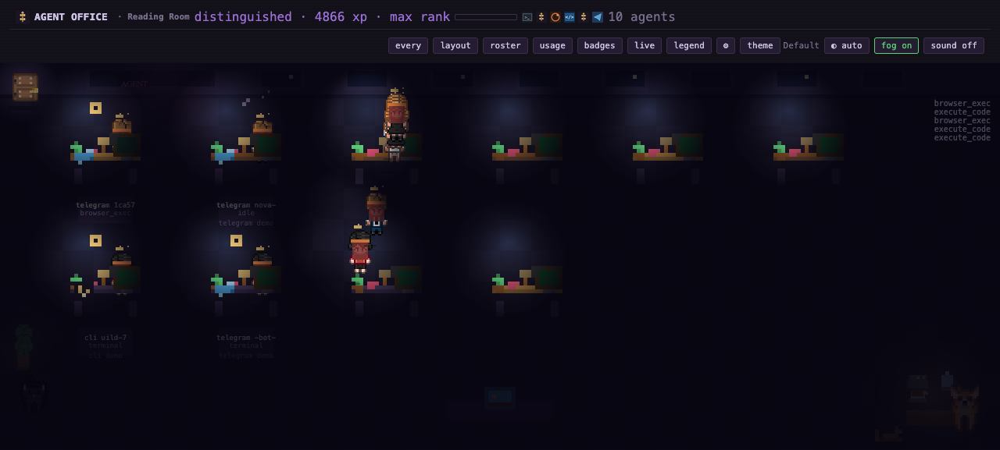

# Agent Office

**Multi-runtime pixel-art virtual office for AI coding agents.**

One floor for every agent you run — Hermes, OpenCode, Claude Code,
Telegram, CLI, and cron. Watch agents sit at desks, type, browse, and ask
for approval. Earn ranks, unlock layouts, collect pets, and map real
project folders to colored office zones.

Observer only. Runtime-agnostic. MIT.

Inspired by [pixel-agents-hq/pixel-agents](https://github.com/pixel-agents-hq/pixel-agents).



## quick start

```bash
git clone https://github.com/NosytLabs/agent-office
cd agent-office
python3 install.py    # detects Hermes / OpenCode / Claude / VS Code
```

Then open **http://127.0.0.1:8113** — no agents handy? `python3 demo_feed.py`

The installer wires only what you already have. Run it again any time to add
a new runtime.

## supported runtimes

| name | what | install |
|---|---|---|
| **Hermes** | this machine's AI agent (host) | already running |
| **OpenCode** | terminal-first CLI from SST | `brew install sst/tap/opencode` |
| **Claude Code** | Anthropic's CLI | `npm i -g @anthropic-ai/claude-code` |
| **Telegram** | Hermes phone bridge | set `TELEGRAM_BOT_TOKEN` |
| **CLI / cron** | shell + scheduled tasks | already wired |

Click **platforms** in the header, or press `P`, for logos, install commands,
and live detection.

## features

- **55 badges** with progress bars — unlock by using agents
- **6 ranks** — intern → junior → staff → senior → principal → distinguished
- **12 unlockable layouts** — open, bullpen, war room, lounge, roof deck, garden,
  library, arcade, penthouse, beach, atelier, spaceship
- **9 themes** — default, midnight, forest, solar, cyberpunk, sunset, ocean, candy, casino
- **4 pets** — cat, dog, fern, fish tank
- **real pixel-art sprite sheets** — 6 characters × 3 directions × 7 frames (walk,
  typing, idle), animated pets (adapted from pixel-agents, MIT — see ATTRIBUTION.md)
- **3 desk types** — wood, standing, glass
- **named areas** painted behind desks + folder→area mapping
- **paint mode** with drag-paint, click character to focus + inspect
- **live event ticker** + speech bubbles + health bar + hourglass
- **import/export layout** + settings persistence
- **reset everything** — settings ⚙ → wipe XP/badges/history/painted tiles
- **keyboard shortcuts** — `R/U/B/L/S/D/E/?/T/P/esc`
- **status legend** + platforms explainer + live feed + raw debug
- **VS Code extension** + Claude Code hook + OpenCode bridge plugin

## how to use

Open **http://127.0.0.1:8113**.

- Click any character to focus — gold ring + inspector panel
- Click again to unfocus
- Click the cat to pet it
- Drag on the canvas in paint mode to color tiles
- Press `?` to see keyboard shortcuts

Header buttons:

- `every` — runtime filter
- `layout` — choose floor layout
- `roster` — every agent + subagent teams
- `usage` — real counters
- `badges` — catalog with progress bars
- `⚙` — settings
- `dbg` — raw JSON state
- `live` — last 30 events
- `legend` — status key
- `theme` — cycle theme
- `platforms` — runtimes + install commands
- `guide` — quick how-to
- `sound` — chime on approval/unlock

## plugin setup

Hermes plugin metadata is in `plugin.yaml`. VS Code extension + Claude hook
+ OpenCode bridge are installed by `install.py`. Re-run it after cloning.

## architecture

See [docs/architecture.md](docs/architecture.md).

```text
Hermes hooks ───┐
OpenCode plugin ┼──► ~/.hermes/pixel-office/events.jsonl ──► /state ──► canvas
Claude hook ────┘                     │
                                     ▼
                              progress.json (XP, ranks, unlocks)
```

## tests

```bash
python3 -m pytest tests/ -q    # 18 tests
```

## repo layout

```text
agent-office/
├── README.md                  (you are here)
├── LICENSE                    (MIT)
├── install.py                 (guided installer)
├── plugin.yaml                (Hermes plugin metadata)
├── __init__.py                (hooks + HTTP server)
├── progress.py                (55 badges, ranks, stats)
├── claude/hook.py             (Claude Code hook)
├── opencode/index.js          (OpenCode bridge plugin)
├── vscode/extension.js        (VS Code extension)
├── web/
│   ├── template.html          (HTML shell)
│   ├── css/style.css          (all styles)
│   ├── js/data.js             (themes, layouts, platforms, ranks)
│   ├── js/office.js           (canvas + UI)
│   ├── assets/*.svg           (5 runtime logos)
│   └── assets/sprites/        (pixel-art character/pet sheets — see ATTRIBUTION.md)
├── tests/                     (18 unit tests)
└── docs/architecture.md
```

## license

MIT. © NosytLabs.
