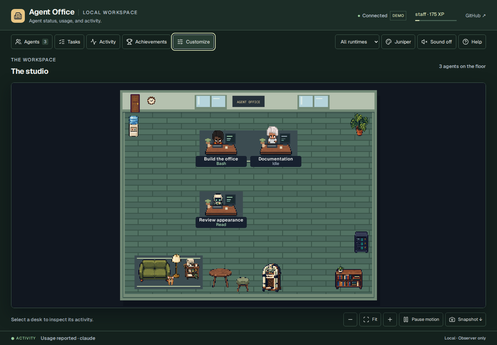

# Agent Office

A local pixel office for watching your coding agents work. See current tools, find sessions waiting for input, inspect subagents, and track the usage your runtimes report.

**Version 0.5.0** · [Product website](https://agent-office-preview-seven.vercel.app/about/) · [Live demo](https://agent-office-preview-seven.vercel.app/) · [Preview guide](docs/preview.md) · [Runtime coverage](docs/runtime-observers.md) · [Contributing](CONTRIBUTING.md)



Agent Office observes existing runtimes. It does not launch agents, send prompts, execute their tools, or grant approvals. Respond to questions and permission requests in the original runtime.

## Start locally

Python 3.10+ is sufficient. The server uses Python's standard library, including SQLite; the frontend needs no build step. Running the office itself requires no account or API key.

```sh
git clone https://github.com/NosytLabs/agent-office.git
cd agent-office
python3 run.py
```

Open **[http://127.0.0.1:8113](http://127.0.0.1:8113)**. The server binds to loopback. Use `python3 run.py --port 8120` for another port.

For an isolated example, run `python3 demo_feed.py` and open **[http://127.0.0.1:8114](http://127.0.0.1:8114)**. Its **DEMO** label identifies synthetic activity. The demo always uses temporary data, even when your shell has a live `HERMES_HOME`. Ctrl+C stops it. The [preview guide](docs/preview.md) covers the shareable demonstration.

## Connect an existing runtime

In another terminal, run:

```sh
python3 install.py
```

The installer detects existing installations and adds observer definitions while preserving unrelated configuration. It does not install the runtimes. Restart each connected runtime after installation; rerun the installer after upgrading Agent Office.

| Integration | Observations | Setup |
| --- | --- | --- |
| Hermes, including Telegram/CLI sessions | Sessions, tools, approvals, subagents; API usage when the installed Hermes exposes the hook | Enables the local `pixel-office` plugin |
| OpenCode | Sessions, tools, permissions, questions, child sessions; assistant-message usage | Adds a local plugin URL; existing JSONC receives manual instructions |
| Claude Code | Session, prompt, tool, approval, question, and subagent hooks | Merges observer hooks into `~/.claude/settings.json` |
| Codex | Session, prompt, tool, permission, subagent, stop, and interrupt hooks | Merges `hooks.json` in `CODEX_HOME` or `~/.codex`; review and trust it through Codex `/hooks` |
| VS Code view | The same office interface beside your editor | Installs the local extension; reload VS Code and run **Agent Office: Open Floor** |

Keep `run.py` running for standalone adapters. Hermes can also start the observer server from its plugin. Set the same `HERMES_HOME` for the server and runtime processes when using a custom data location.

The in-app **Connection guide** provides setup and troubleshooting. A reachable office server does not establish that a runtime is delivering events. Adapter fixtures have exercised actual publication, SQLite ingestion, HTTP state, and browser flows; installed Hermes, Claude Code, Codex, and OpenCode CLI sessions were unavailable in the validation environment. See [coverage and remaining checks](docs/audit/README.md), including the separate VS Code extension-host limitation.

## Activity, usage, and room controls

- **Watch work:** tool activity, parallel calls, parent/child relationships, status filters, custom display names, and an observed task board. The needs-input control cycles through waiting sessions. A quiet-agent notice opens its last reported status and tool; silence alone does not establish that work is stuck or finished.
- **Inspect history:** search retained events, focus on a session, inspect current activity, and export recorded data. The UI reconnects automatically and labels a retained scene when disconnected.
- **Read reported usage:** token totals by runtime and model, plus usage for visible sessions. Missing values say **Not reported**; partial coverage remains visible. Dollar amounts are labeled runtime estimates, with their source. An optional cost threshold shows an alert without stopping a runtime.
- **Arrange the room:** choose among **22 props**, move or remove custom furniture, undo/redo edits, and import/export preferences. Saves enter history after server confirmation; a failed save preserves retryable edits. Layout reflow keeps saved positions intact.
- **Make it yours:** choose a room theme, including Juniper, and classic, walnut, or slate desks. Give each agent a preferred desk and choose its default appearance, one of six people, or the animated studio robot. Assignments use session IDs, so renaming an agent does not lose its preference. Appearance settings do not create activity or change XP.
- **Use the camera:** zoom, drag while zoomed, return to Fit, pause animation, or save a scene image. Safe view preferences are remembered separately in the local observer and public demo. At Fit, mobile swipes scroll the page. Reduced-motion preferences pause motion without stopping tracking.

Claude hooks do not report token usage. Hermes reports supported main-loop API attempts. OpenCode reports assistant-message counters and runtime cost estimates. Codex usage can be imported from an already captured `codex exec --json` stream with a stable capture ID. See [exact usage semantics and commands](docs/runtime-observers.md); the office does not infer pricing or present these values as an invoice.

### Earned room rewards

The catalog contains **37 reachable achievements**, with XP, progress, and visible reward descriptions. Six furniture choices unlock through observed activity:

| Activity | Placeable reward |
| --- | --- |
| 100 tool starts | Arcade cabinet |
| 5 sessions | Record player |
| 1 subagent start | Desk robot |
| 25 read/search tools | Terrarium |
| 500 tool starts | Focus booth; opens the task board |
| 10 distinct tools | Filing cabinet; opens saved history |

Other milestones add ferns, cats, mugs, monitor trim, and room accents. The warm lamp unlocks after 50 observed tool calls. XP records observed events and achievements; it does not measure code quality or task completion. Error events remain in statistics, while errors, theme changes, and session time of day do not award XP. Retired achievement entries are removed while earned XP, existing statistics, and previously earned lamp appearances remain. Runtime aliases count as one runtime family for achievements.

### Aquarium and jukebox

The aquarium has four selectable fish: one available immediately, with others unlocked by **10 read/search tools**, **25 tool starts**, and **one valid usage report**. Name the aquarium, choose its inhabitants, and feed them by pointer or keyboard. Fish interactions do not create runtime activity or award work XP.

The public repository and preview include original fish art. An [optional offline importer](docs/aquarium-assets.md) can use the verified Smallburg Diving sheets from an existing, legitimately licensed Little Current checkout. Those commercial source assets are not distributed with Agent Office.

The jukebox synthesizes three original Web Audio loops locally. Choose a track and press **Play music** to start it. Muting sound, hiding the tab, or leaving the page stops playback; returning does not autoplay.

Cats can wander, approach idle agents, rest, and move away from active work. Customize controls pet visibility and movement, while names and earned cat rewards remain persistent. These are bounded animation behaviors, not model calls; pet interactions do not add work XP.

## Local data and retention

Data lives in `$HERMES_HOME/pixel-office`, defaulting to `~/.hermes/pixel-office`. SQLite holds authoritative progress, live state, history, and usage accounting. `settings.json` stores room preferences; `progress.json` is a compatibility mirror. Events can include command, question, or file-path previews. The office serves local assets and makes no analytics or model-provider requests.

Raw activity is limited by **1,000 events, seven days, and 5 MiB by default**, keeping the newest records that fit all three limits. Change these in Customize. Trimming history preserves earned XP, usage totals, and unresolved approvals. **Clear history** removes retained activity; **Reset progress** also clears live tracking, XP, achievements, and the usage ledger, while retaining room preferences.

The history limit is not a cap on the whole database. Compact per-usage identities remain for exact replay handling and corrections. An offline server leaves pending inbox files until it runs again. Old `events.jsonl` integrations remain readable, but their files are not rewritten or truncated. Storage notices identify backlog, invalid records, or a nearly full raw-history byte allowance. [Architecture](docs/architecture.md) explains these boundaries and reset recovery.

## Help and development

For an empty room, verify that the server is running, restart the configured runtime, and check their shared data location. For another VS Code endpoint, change `hermesPixelOffice.stateUrl` to its `/state` URL and use **Agent Office: Reload Connection**. Full extension setup and packaging instructions are in [vscode/README.md](vscode/README.md).

See [CONTRIBUTING.md](CONTRIBUTING.md) for Python, Node, formatting, and browser checks, and [validation evidence](docs/audit/README.md) for screenshots and integration limits.

The product website lives in `site/`. Build it with `npm run build:site`; its relative assets work under a GitHub Pages project path. The [public website and demo guide](docs/preview.md) covers the Pages workflow, static output, and preview hosting.

## Sources and license

Design references include [Pixel Agents](https://github.com/pixel-agents-hq/pixel-agents), [Hootbu's Pixel Agents](https://github.com/hootbu/pixel-agents), [Harish Kotra's AgentOffice](https://github.com/harishkotra/agent-office), [AgentSystemLabs](https://github.com/AgentSystemLabs/agent-office), [Claw3D](https://www.claw3d.ai/#features), and [thepixeloffice.ai](https://thepixeloffice.ai/). [The source review](docs/reference-review-2026-10-07.md) records inspected code paths, adopted concepts, and license boundaries. This project is independent of those products and the runtimes it observes.

Project code is [MIT licensed](LICENSE). Retain the applicable notices in [sprite provenance](web/assets/sprites/ATTRIBUTION.md) and [font, icon, and runtime mark credits](web/assets/ATTRIBUTION.md). Optional local commercial artwork remains subject to its own license.
