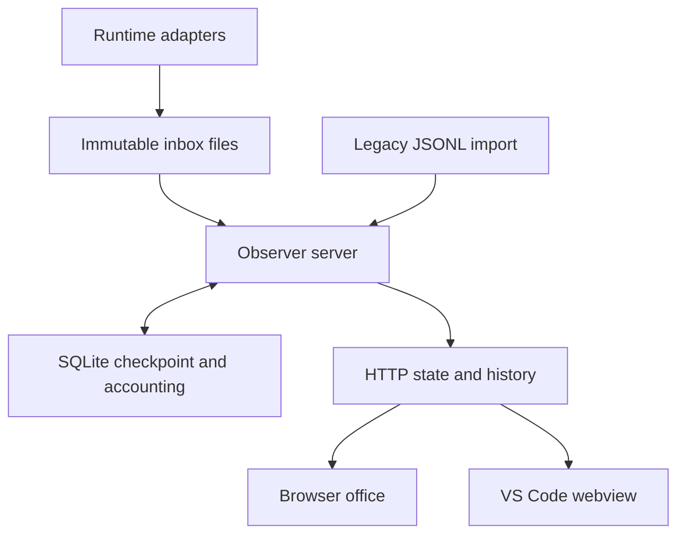

# Architecture

Agent Office 0.5.0 is a local observer. Runtime adapters publish observations; a Python server commits their effects to SQLite; a browser renders the office. The VS Code extension embeds that same frontend. Python's standard library provides the server and database, and the production frontend has no bundler or npm dependency.

## Data flow

The observer does not execute tasks, supply prompts, decide permissions, or send messages. An approval or question remains an observed need for input; the user responds through its original runtime. Pets, music, and room interactions do not create agent sessions or work events.

## Components

| Component | Responsibility |
| --- | --- |
| [`run.py`](../run.py), [`demo_feed.py`](../demo_feed.py) | Standalone server and isolated synthetic demo |
| [`__init__.py`](../__init__.py) | Hermes adapter, settings, HTTP routes, and background ingestion |
| [`event_inbox.py`](../event_inbox.py) | Python publication protocol and reset-epoch reads |
| [`event_store.py`](../event_store.py) | SQLite transactions, receipt cleanup, legacy migration, retention, and reset recovery |
| [`state_model.py`](../state_model.py) | Incremental sessions, concurrent tools, pending input, and lifecycle transitions |
| [`progress.py`](../progress.py) | XP, the active achievement catalog, runtime aliases, and retired-record cleanup |
| [`usage.py`](../usage.py) | Stable usage identities, replacement corrections, coverage, and materialized aggregates |
| [`claude/hook.py`](../claude/hook.py), [`codex/hook.py`](../codex/hook.py), [`codex/stream.py`](../codex/stream.py), [`opencode/index.js`](../opencode/index.js) | Runtime-specific payload normalization |
| [`install.py`](../install.py) | Detection and additive configuration of existing runtimes and the VS Code view |
| [`web/js/office.js`](../web/js/office.js), [`editor.js`](../web/js/editor.js) | Polling, panels, settings reconciliation, and transactional furniture editing |
| [`web/js/data.js`](../web/js/data.js), [`scene.js`](../web/js/scene.js) | Shared geometry, assets, camera, movement, drawing, and hit testing |
| [`web/js/aquarium.js`](../web/js/aquarium.js), [`jukebox.js`](../web/js/jukebox.js) | Optional fish simulation and gesture-started local music |
| [`vscode/extension.js`](../vscode/extension.js), [`panel.js`](../vscode/panel.js) | Extension commands, URL forwarding, bounded connection checks, and the webview shell |

## Publication and commit boundaries

Each bundled publisher writes one complete envelope to a temporary file, then atomically renames it into `inbox/`. The envelope carries its protocol version, reset epoch, and normalized event. A unique filename supplies a receipt identity and deterministic publication order, independent of the event's source timestamp. Two intentional publications with identical payloads remain two observations. Publishers must not reuse receipt filenames.

The server drains at most 2,048 available records per batch. Its maintenance loop runs approximately once per second even with no browser connected; HTTP reads also ingest available observations. Oversized or malformed records are skipped and counted, while unreadable files remain for retry. The current record limit is 256 KiB.

Each drain uses SQLite `BEGIN IMMEDIATE`, so cooperating consumer processes serialize writes. One transaction updates:

- The incremental live model, including each session's parallel calls and pending prompts.
- XP, achievements, receipt count, and the retained event window.
- Usage-unit corrections and aggregate totals.
- Receipt acknowledgments and the authoritative checkpoint.

Acknowledged files are deleted **after commit**. Their receipt is removed only once the corresponding file is absent. A process failure before commit leaves its inputs retryable. A failure after commit but before cleanup leaves the receipt available to suppress replay of that file. Filesystem or hook failures before successful publication cannot be recovered by the observer.

New-protocol ingestion never reconstructs live state from the raw history window. Pruning activity therefore cannot erase a quiet session's unanswered approval. Source timestamps remain useful event metadata, but newly received records count even when those clocks move backward. Receipt time controls new-protocol session age and raw-history age.

## Storage and retention

Files default to `~/.hermes/pixel-office/`; `HERMES_HOME` changes the parent directory. Server and publishers must use the same location.

| File or directory | Role |
| --- | --- |
| `office.sqlite3` | Authoritative checkpoint, bounded raw history, pending receipts, legacy cursor, and usage accounting |
| `inbox/` | Complete, unacknowledged observations plus temporary publications |
| `event-epoch` | Atomic publication fence; after a reset, its durable reset intent |
| `progress.json` | Legacy import source on first database creation; exported compatibility mirror afterward |
| `settings.json` | Validated room, display, sound, aquarium, and retention preferences |
| `events.jsonl` | Optional legacy input; never rewritten or truncated by the new protocol |
| `assets/` | Optional local user art, including a separately installed aquarium pack |

Raw history retains the newest records satisfying all configured limits:

| Limit | Default | Available values |
| --- | --- | --- |
| Event count | 1,000 | 250 / 1,000 / 5,000 |
| Age by receipt time | 7 days | 1 / 7 / 30 days |
| Encoded event bytes | 5 MiB | 1 / 5 / 20 MiB |

The byte limit counts UTF-8 event JSON, not total SQLite file size. `/state` returns up to 30 retained recent events; `/history` reads the retained history separately. Pruning also updates the recent-event window. XP, live checkpoints, and usage accounting are independent of raw retention.

Three stores can grow beyond the raw-history limit: an offline inbox, the compact usage identity/aggregate ledger, and a legacy writer's JSONL file. Unanswered prompts also remain in live state until resolved or reset. These are deliberate retention boundaries rather than a hard whole-directory size guarantee. The settings panel reports retained-history bytes and database size separately, with notices for backlog, invalid records, or approaching the configured byte limit.

### Legacy migration

On first database creation, `progress.json` supplies existing XP and statistics. The original timestamp boundary is used only for this otherwise unidentified historical progress; it cannot establish exact identity for every old event. Subsequent legacy appends use their verified prefix and position, so a new line with an older timestamp still counts.

Legacy reads reuse a private parsed cache only while path, inode, size, modification time, and change time match. Before/after checks reject a concurrently changing snapshot. A changed legacy file still requires a full read. Rewrites compare fingerprint occurrence counts conservatively; a rewrite without stable source IDs cannot always distinguish a new identical event from old history. A legacy rewrite cannot replace live state already established by new inbox publishers.

Rerunning the installer moves bundled adapters to the inbox protocol. Keeping legacy JSONL read-only avoids truncation races with an older writer. Old source files remain on disk after resets; the reset cursor fences their preceding contents rather than deleting an active append target.

## Reset protocol

**Clear history** deletes raw activity while preserving progress, usage, and live state. **Reset progress** clears raw history, the live model, XP, achievements, and both usage tables; it retains room preferences.

A reset holds the SQLite writer transaction while obtaining a stable legacy prefix. Before changing the database, it atomically publishes a new JSON reset intent in `event-epoch`. That intent contains the new epoch and the legacy boundary and defines when the reset takes effect.

If the process stops after publishing the intent but before committing the database reset, the next database load completes the pending reset transactionally. It never restores the older epoch over the published fence. New-epoch publications survive recovery. A publisher that prepared an old-epoch event before reset cannot reintroduce it by finishing its rename afterward. An append beyond the fenced legacy prefix remains available for ingestion.

If a continuously changing legacy file prevents a stable boundary, reset fails before publishing its intent and preserves existing data. Crash and append-race regressions are in [`test_reset_protocol.py`](../tests/test_reset_protocol.py).

## Live state and display lifetime

Call IDs keep simultaneous tools separate. Pending permission and question records have independent identities; resolving one does not clear another. Completed or ended sessions keep inactive markers so late completions do not recreate their avatars.

| Condition | Display behavior |
| --- | --- |
| Working/thinking, no new observation for more than 300 seconds | Display as idle with a quiet flag; preserve last reported status and tool for inspection |
| Ended (`gone`), more than 20 seconds | Remove the exit sprite |
| Completed subagent (`done`), more than 120 seconds | Remove the completed sprite |
| Ordinary quiet session, more than 30 minutes | Expire live state |
| Unresolved approval or question | Keep visible beyond quiet expiry until resolved or reset |

New inbox events use the server receipt clock for these ages. Legacy imports retain historical ages and clamp future source clocks. Completed and ended session durations stop at their terminal observation; time spent showing the exit animation does not extend them. The quiet-agent notice points to the last observation; silence is not proof that a process is stuck or finished. Display expiry does not change lifetime counters. Concurrent-agent achievements exclude completed and ended exit sprites.

## Usage accounting

A usage unit is identified by `(platform, session_id, usage_id)`. Each report is a full replacement snapshot for that source unit. A repeated identical snapshot is a no-op; a changed snapshot removes the old contribution and adds the corrected one in the same transaction as its event receipt. Adapters must not report both step amounts and the total containing those same steps.

Input and output are inclusive counters. Cached input and cache writes are subsets of input; reasoning is a subset of output. Preserve an explicit source total; derive a total only when both input and output are known. Missing values remain `null`, distinct from reported zero. Each aggregate carries per-field report coverage, so partial measurements are visible.

Costs come only from reported runtime estimates and retain their source label. There is no price table, inferred invoice, or billing enforcement. OpenCode may report zero when runtime pricing is missing. Supported Hermes and Codex records can report tokens without a monetary amount. [Runtime contracts](runtime-observers.md) document these differences.

The compact ledger stores IDs, model/provider metadata, counters, and accounting fingerprints, with no prompts, commands, or output bodies. It grows with unique usage units because arbitrary replay detection and later corrections require the prior contribution. History pruning leaves it intact; Reset progress clears it. Materialized lifetime, model, runtime, and session aggregates avoid refolding this ledger for every poll. The state endpoint retrieves session aggregates for visible agents while retaining lifetime totals.

Without a source revision, an older differing snapshot is indistinguishable from a later correction. Adapters therefore need a stable identity and a documented snapshot contract, not timestamp-based deduplication.

## Frontend and extension

The canvas separates world geometry from display resolution and uses nearest-neighbor sprite sampling. Shared collision bounds drive rendering, placement, selection, and pathfinding. Saved normalized prop positions survive viewport changes; a bounded resolver finds nearby free floor when necessary and reports props that cannot fit.

The furniture editor provides 20 in-session undo steps. It changes history only after a successful settings save. Pending settings patches replay over the latest confirmed values; a failed earlier write cannot overwrite a later queued edit. An external replacement of custom furniture invalidates stale index-based history. At Fit, touch permits vertical page scrolling; zoom and edit modes reserve canvas gestures. Cancelled gestures do not commit moves.

The active catalog contains 44 reachable achievements and 20 furniture choices, including four earned prop choices. Retired unlock/recent records are removed without subtracting XP or changing statistics. Runtime aliases are canonicalized for achievement conditions while their recorded platform statistics are preserved.

The aquarium has bounded food particles, four selectable species, and unlocks derived from real counters. Optional licensed local fish sheets replace only art; the public bundle uses original art. The jukebox synthesizes three original loops through Web Audio after a play gesture. Mute, page exit, and tab hiding stop playback; no saved setting starts it automatically.

The VS Code extension hosts the shared frontend in an iframe. It forwards configured HTTP(S) URLs with `asExternalUri`, performs one bounded connection probe per open/reload, and offers reload/browser/settings commands. Its nonce-protected shell exposes only fixed extension actions and grants no webview access to workspace files. The frontend owns continuing polling. See [extension setup](../vscode/README.md) and [validation limits](audit/README.md).

## HTTP surface

| Method | Path | Purpose |
| --- | --- | --- |
| GET | `/` | Office frontend |
| GET | `/state` | Visible agents, recent events, progress, usage, tracking, settings, and live/demo marker |
| GET | `/history?limit=1000` | Retained activity, newest first; response limit clamped to 1–5,000 |
| DELETE | `/history` | Clear raw activity while retaining progress, usage, and live state |
| DELETE | `/state` | Reset tracking/progress/usage; preserve room settings |
| GET / POST | `/settings` | Read or partially update validated settings; JSON writes limited to 64 KiB |
| GET | `/js/*`, `/css/*`, `/assets/*` | Bundled frontend assets |
| GET | `/assets-manifest`, `/user/<name>.svg` | Compatibility inventory and local user SVGs |
| GET | `/user/aquarium/manifest.json`, `/user/aquarium/<fish-id>.png` | Optional local aquarium pack |

The server binds to `127.0.0.1`. The [shareable preview](preview.md) is a separate demonstration, not a hosted endpoint for a user's local history or runtime controls.
