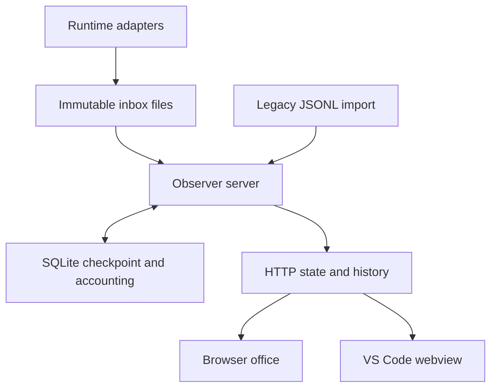

# Architecture

Agent Office is a local observer with an optional standalone task runner. Runtime adapters publish observations; a Python server commits their effects to SQLite; a browser renders the office. The VS Code extension embeds that same frontend. Python's standard library provides the server, process management, and database, and the production frontend has no bundler or npm dependency.

## Data flow



The observer adapters do not execute tasks, supply prompts, decide permissions, or send messages. An approval or question remains an observed need for input; the user responds through its original runtime. Pets, music, and room interactions do not create agent sessions or work events.

The standalone `--enable-task-runner` option adds a separate execution path:
**Local runs → same-origin HTTP → fixed CLI adapter → child process**. It
requires allowlisted projects at startup, carries an exact prompt over stdin,
and tracks process output and exit status in bounded server memory. It does
not write synthetic observations or mark source task lists complete. The
ordinary startup command, Hermes observer, and public static preview keep
execution disabled. See [the runner contract](local-task-runner.md).

## Components

| Component | Responsibility |
| --- | --- |
| [`run.py`](../run.py), [`demo_feed.py`](../demo_feed.py) | Standalone server and isolated synthetic demo |
| [`__init__.py`](../__init__.py) | Hermes adapter, settings, HTTP routes, and background ingestion |
| [`event_inbox.py`](../event_inbox.py) | Python publication protocol and reset-epoch reads |
| [`event_store.py`](../event_store.py) | SQLite transactions, receipt cleanup, legacy migration, retention, and reset recovery |
| [`state_model.py`](../state_model.py) | Incremental sessions, concurrent tools, pending input, and lifecycle transitions |
| [`tasks.py`](../tasks.py) | Bounded source task snapshots and capture replay memory, independent of lifecycle and XP |
| [`task_runner.py`](../task_runner.py) | Optional fixed CLI adapters, validated project admission, process lifecycle, and bounded output |
| [`settings_store.py`](../settings_store.py) | Revisioned settings reads, conditional atomic writes, and preservation of unavailable files |
| [`progress.py`](../progress.py) | XP, the active achievement catalog, runtime aliases, and retired-record cleanup |
| [`usage.py`](../usage.py) | Stable usage identities, replacement corrections, coverage, and materialized aggregates |
| [`claude/hook.py`](../claude/hook.py), [`codex/hook.py`](../codex/hook.py), [`codex/stream.py`](../codex/stream.py), [`opencode/index.js`](../opencode/index.js) | Runtime-specific payload normalization |
| [`install.py`](../install.py) | Detection and additive configuration of existing runtimes and the VS Code view |
| [`web/js/office.js`](../web/js/office.js), [`editor.js`](../web/js/editor.js) | Polling, panels, settings reconciliation, and transactional furniture editing |
| [`web/js/tasks-view.js`](../web/js/tasks-view.js) | Read-only source task lists, provenance, and focus-preserving reconciliation |
| [`web/js/task-runner.js`](../web/js/task-runner.js) | Local run form, idempotent submission, captured output, and cancellation |
| [`web/js/data.js`](../web/js/data.js), [`scene.js`](../web/js/scene.js) | Shared geometry, assets, camera, movement, drawing, and hit testing |
| [`web/js/aquarium.js`](../web/js/aquarium.js), [`jukebox.js`](../web/js/jukebox.js) | Optional fish simulation and gesture-started local music |
| [`web/js/room.js`](../web/js/room.js), [`arcade.js`](../web/js/arcade.js) | Object actions, persistent light switches, and the arcade game lifecycle |
| [`vscode/extension.js`](../vscode/extension.js), [`panel.js`](../vscode/panel.js) | Extension commands, URL forwarding, bounded connection checks, and the webview shell |

## Publication and commit boundaries

Each bundled publisher writes one complete envelope to a temporary file, then atomically renames it into `inbox/`. The envelope carries its protocol version, reset epoch, and normalized event. A unique filename supplies a receipt identity and deterministic publication order, independent of the event's source timestamp. Two intentional publications with identical payloads remain two observations. Publishers must not reuse receipt filenames.

The server drains at most 2,048 available records per batch. Its maintenance loop runs approximately once per second even with no browser connected; HTTP reads also ingest available observations. Oversized or malformed records are counted and acknowledged without applying their contents. The current record limit is 256 KiB.

Unreadable files remain for retry, normally after five seconds. The retry queue is durable and shares each batch with new inputs, so one failed publisher cannot starve unrelated writers. For bundled filenames, an unreadable record blocks later records from the same writer until it can be read or is confirmed absent. This preserves that writer's corrections across restarts. Custom filenames without a trustworthy writer ID remain retryable without inventing ordering relationships.

Each drain uses SQLite `BEGIN IMMEDIATE`, so cooperating consumer processes serialize writes. One transaction updates:

- The incremental live model, including each session's parallel calls and pending prompts.
- Valid source task-board replacements and bounded capture replay memory.
- XP, achievements, receipt count, and the retained event window.
- Usage-unit corrections and aggregate totals.
- Receipt acknowledgments and the authoritative checkpoint.

Acknowledged files are deleted **after commit**. Their receipt is removed only once the corresponding file is absent. A process failure before commit leaves its inputs retryable. A failure after commit but before cleanup leaves the receipt available to suppress replay of that file. Filesystem or hook failures before successful publication cannot be recovered by the observer.

New-protocol ingestion never reconstructs live state from the raw history window. Pruning activity therefore cannot erase a quiet session's unanswered approval. Source timestamps remain useful event metadata, but newly received records count even when those clocks move backward. Receipt time controls new-protocol session age and raw-history age.

## Storage and retention

Files default to `~/.hermes/pixel-office/`; `HERMES_HOME` changes the parent directory. Server and publishers must use the same location.

| File or directory | Role |
| --- | --- |
| `office.sqlite3` | Authoritative checkpoint, bounded raw history, pending receipts, legacy cursor, and usage accounting |
| `inbox/` | Complete, unacknowledged observations plus temporary publications |
| `event-epoch` | Atomic publication fence; after a reset, its durable reset intent |
| `progress.json` | Legacy import source on first database creation; exported compatibility mirror afterward |
| `settings.json` | Validated room, display, sound, aquarium, and retention preferences |
| `events.jsonl` | Optional legacy input; never rewritten or truncated by the new protocol |
| `assets/` | Optional local user art, including a separately installed aquarium pack |

Raw history retains the newest records satisfying all configured limits:

| Limit | Default | Available values |
| --- | --- | --- |
| Event count | 1,000 | 250 / 1,000 / 5,000 |
| Age by receipt time | 7 days | 1 / 7 / 30 days |
| Encoded event bytes | 5 MiB | 1 / 5 / 20 MiB |

The byte limit counts UTF-8 event JSON, not total SQLite file size. `/state` returns up to 30 retained recent events; `/history` reads the retained history separately. Pruning also updates the recent-event window. XP, live checkpoints, and usage accounting are independent of raw retention.

Automatic pruning is suspended when `settings.json` cannot be read or parsed, is not a regular file, or contains a present but unsupported retention value. `/state` reports `tracking.retention_suspended` and unavailable settings while observation continues. Defaults must never silently replace an unreadable longer retention policy. A genuinely absent file uses the documented defaults; repairing the file resumes automatic pruning.

An offline inbox, the compact usage ledger, and a legacy writer's JSONL file can grow beyond the raw-history limit. Unanswered prompts remain until resolved or reset. Task checkpoints retain at most 128 boards independently of raw history. These are separate retention boundaries, not a hard whole-directory quota.

The `tracking` object reports the following independent measurements:

| Fields | Meaning |
| --- | --- |
| `retained`, `retained_bytes` | Raw history rows and their encoded UTF-8 JSON bytes |
| `database_bytes`, `legacy_log_bytes` | The database and legacy log file-entry sizes; not a sum of the entire office directory |
| `inbox_files`, `inbox_bytes` | All direct, non-directory inbox entries, including temporary and cleanup-pending files |
| `backlog`, `backlog_bytes` | Unacknowledged `.json` files awaiting processing |
| `cleanup_pending`, `cleanup_pending_bytes` | Acknowledged files still on disk after cleanup could not remove them |
| `temporary_files`, `temporary_bytes`, `retrying_files` | Unfinished publications and files with a recorded read retry; these overlap the inbox totals |
| `usage_units` | Persisted unique accounting units, maintained transactionally with insertions, corrections, and reset |
| `measurement_errors` | Categories whose inventory or legacy read could not be completed |

Known absence is zero; a failed measurement is `null`, never a plausible partial total. Directory scans use entry metadata without opening symlink targets. A disappearing entry is omitted, while a failed scan invalidates the affected totals. A legacy file can have a known byte size but an unreadable body; `legacy_log_read` reports that separate failure. UI warnings must preserve these distinctions.

### Explicit SQLite maintenance

From the repository checkout, inspect an existing office without starting the
server or draining its inbox:

```sh
python tools/maintain.py
python tools/maintain.py --directory /path/to/pixel-office
```

The default directory is `$HERMES_HOME/pixel-office`, or
`~/.hermes/pixel-office` when `HERMES_HOME` is unset. A missing directory or
database is reported without creating one. The JSON report measures the main
database and its `-wal`, `-shm`, and `-journal` files separately. Their summed
file-entry lengths are `database_total_bytes`; this excludes inbox files,
legacy logs, user art, and other directory contents. Unknown measurements are
`null` and make the sum unavailable. Nonregular database files or sidecars are
reported as unavailable without following their links.

The `sqlite` object reports the journal mode, auto-vacuum mode, page size,
logical page count, and whole free pages. `logical_bytes` includes committed
database pages that may currently reside in the WAL; it is not another file to
add to the measured total. `freelist_bytes` counts reusable whole pages, not
all space a rebuild could reclaim. A zero freelist can still accompany
partially filled pages. These are observed sizes, not a directory quota or a
prediction of space savings.

To explicitly rebuild an existing, recognized office database:

```sh
python tools/maintain.py --compact
python tools/maintain.py --directory /path/to/pixel-office --compact --timeout 1
```

Compaction runs SQLite `VACUUM`; it does not trim retained history or change
retention settings. It preserves declared event IDs, usage identities and
correction baselines, XP, task checkpoints, receipts, retries, and reset
recovery state. It neither consumes nor deletes pending inbox publications,
temporary publisher files, legacy logs, settings, or unknown sidecars. An
unreadable settings file does not prevent physical compaction: no retention
policy is used. Ordinary ingestion, Clear history, and Reset progress never
invoke this rebuild automatically.

New office databases use FULL auto-vacuum, which already returns whole freed
pages after commits. VACUUM also repacks partially filled pages. In an isolated
usage-correction workload, Clear history left a FULL-mode database with 1,800
usage identities at 1,105,920 bytes and zero free pages. Explicit VACUUM
reduced it to 622,592 bytes while preserving every logical table row. This is
one measured example, not a promised compression ratio. Accounting storage
still grows with unique usage units because exact arbitrary replay and later
corrections require those identities.

Maintenance obtains an exclusive SQLite lock and retains it across schema
validation, the rebuild, and integrity checks. VACUUM runs outside an explicit
transaction. For an existing WAL-mode database, SQLite checkpoints and
truncates its own WAL under that same exclusive lock; the tool never unlinks a
WAL or switches journal modes. The app itself does not enable WAL. Active
readers or writers can prevent maintenance, so stop office servers and other
database tools before a large rebuild. Immutable inbox publishers can continue
writing; their observations wait for the next normal drain.

`--timeout` bounds the lock wait to 0–5 seconds (default one second), not the
duration of a successfully started rebuild. VACUUM scans and rewrites the
database and may require up to twice its size in additional free disk space.
Logical rows are not copied into a Python collection. SQLite owns transaction
rollback and journal recovery on failure. The result includes observed
`before` and `after` reports and their net `reclaimed_bytes`; that value can be
zero, negative, or unavailable, and activity after the lock is released can
change file sizes again. A failed final measurement is not reported as zero.

Exit status is **0** for a successful report or compaction, **1** for an
unavailable measurement, invalid target, or failed operation, and **2** for a
busy database or invalid command-line arguments. A busy run can be retried
after the other connection closes. A compaction error can occur during final
verification after the rebuild committed; inspect the error rather than
assuming either a completed maintenance operation or a reverted physical file.
Schema and integrity checks reject unknown or damaged databases rather than
initializing or repairing them.

The concurrency and disk-space contracts follow the official
[SQLite VACUUM](https://www.sqlite.org/lang_vacuum.html),
[locking-mode](https://www.sqlite.org/pragma.html#pragma_locking_mode),
[auto-vacuum](https://www.sqlite.org/pragma.html#pragma_auto_vacuum), and
[WAL](https://www.sqlite.org/wal.html) documentation. Regression coverage is in
[`test_storage_maintenance.py`](../tests/test_storage_maintenance.py), including
pending reset recovery, live WAL readers, busy retries, unavailable sizes,
preserved ancillary files, and replay/corrections after compaction.

### Legacy migration

On first database creation, `progress.json` supplies existing XP and statistics. The original timestamp boundary is used only for this otherwise unidentified historical progress; it cannot establish exact identity for every old event. Subsequent legacy appends use their verified prefix and position, so a new line with an older timestamp still counts.

Legacy reads reuse a private parsed cache only while path, inode, size, modification time, and change time match. Before/after checks reject a concurrently changing snapshot. A changed legacy file still requires a full read. Rewrites compare fingerprint occurrence counts conservatively; a rewrite without stable source IDs cannot always distinguish a new identical event from old history. A legacy rewrite cannot replace live state already established by new inbox publishers.

A stat, open, or mid-read I/O failure preserves the previous legacy cursor and live state. It is not an empty file or a shorter rewrite. Other inbox writers continue to drain; the failed legacy source is retried after access recovers.

Rerunning the installer moves bundled adapters to the inbox protocol. Keeping legacy JSONL read-only avoids truncation races with an older writer. Old source files remain on disk after resets; the reset cursor fences their preceding contents rather than deleting an active append target.

## Reset protocol

**Clear history** deletes raw activity while preserving progress, usage, and live state. **Reset progress** clears raw history, the live model, XP, achievements, and both usage tables; it retains room preferences.

A reset holds the SQLite writer transaction while obtaining a stable legacy prefix. Before changing the database, it atomically publishes a new JSON reset intent in `event-epoch`. That intent contains the new epoch and the legacy boundary and defines when the reset takes effect.

If the process stops after publishing the intent but before committing the database reset, the next database load completes the pending reset transactionally. It never restores the older epoch over the published fence. New-epoch publications survive recovery. A publisher that prepared an old-epoch event before reset cannot reintroduce it by finishing its rename afterward. An append beyond the fenced legacy prefix remains available for ingestion.

If an unreadable or continuously changing legacy file prevents a complete, stable boundary, reset fails before publishing its intent and preserves existing data. Crash and append-race regressions are in [`test_reset_protocol.py`](../tests/test_reset_protocol.py); partial-read preservation is covered in [`test_event_cache.py`](../tests/test_event_cache.py).

## Live state and display lifetime

Call IDs keep simultaneous tools separate. Pending permission and question records have independent identities; resolving one does not clear another. Completed or ended sessions keep inactive markers so late completions do not recreate their avatars.

| Condition | Display behavior |
| --- | --- |
| Working/thinking, no new observation for more than 300 seconds | Display as idle with a quiet flag; preserve last reported status and tool for inspection |
| Ended (`gone`), more than 20 seconds | Remove the exit sprite |
| Completed subagent (`done`), more than 120 seconds | Remove the completed sprite |
| Ordinary quiet session, more than 30 minutes | Expire live state |
| Unresolved approval or question | Keep visible beyond quiet expiry until resolved or reset |

New inbox events use the server receipt clock for these ages. Legacy imports retain historical ages and clamp future source clocks. Completed and ended session durations stop at their terminal observation; time spent showing the exit animation does not extend them. The quiet-agent notice points to the last observation; silence is not proof that a process is stuck or finished. Display expiry does not change lifetime counters. Concurrent-agent achievements exclude completed and ended exit sprites.

## Usage accounting

A usage unit is identified by `(platform, session_id, usage_id)`. Each report is a full replacement snapshot for that source unit. A repeated identical snapshot is a no-op; a changed snapshot removes the old contribution and adds the corrected one in the same transaction as its event receipt. Adapters must not report both step amounts and the total containing those same steps.

Input and output are inclusive counters. Cached input and cache writes are subsets of input; reasoning is a subset of output. Preserve an explicit source total; derive a total only when both input and output are known. Missing values remain `null`, distinct from reported zero. Each aggregate carries per-field report coverage, so partial measurements are visible.

Costs come only from reported runtime estimates and retain their source label. There is no price table, inferred invoice, or billing enforcement. OpenCode may report zero when runtime pricing is missing. Supported Hermes and Codex records can report tokens without a monetary amount. [Runtime contracts](runtime-observers.md) document these differences.

The compact ledger stores IDs, model/provider metadata, counters, and accounting fingerprints, with no prompts, commands, or output bodies. It grows with unique usage units because arbitrary replay detection and later corrections require the prior contribution. History pruning leaves it intact; Reset progress clears it. Materialized lifetime, model, runtime, and session aggregates avoid refolding this ledger for every poll. The state endpoint retrieves session aggregates for visible agents while retaining lifetime totals.

Without a source revision, an older differing snapshot is indistinguishable from a later correction. Adapters therefore need a stable identity and a documented snapshot contract, not timestamp-based deduplication.

## Source-reported tasks

`tasks_update` replaces one complete board keyed by exact `(runtime, session_id)`. Valid statuses are `pending`, `in_progress`, `completed`, and `cancelled`; priority is optionally `high`, `medium`, or `low`. Boards contain at most 100 rows, with 512-character content and 256-character row IDs. A malformed or oversized snapshot is rejected in full. Only an explicit empty list clears a board; missing task coverage remains unknown.

OpenCode reports `todo.updated`; the optional Codex stream reader reports `todo_list` items. Their row IDs are positional within a snapshot. Neither source supplies a task update timestamp, so `source_updated_at` is `null`; `observed_at` and `age_s` describe observer receipt freshness. If another supported source supplies a valid source clock, an older same-source clock cannot replace its newer snapshot.

The version-1 live checkpoint adds `task_boards`, defaulting to an empty list for older checkpoints. It retains the 128 most recently accepted boards, independently of raw-history pruning. Each board keeps up to eight internal capture watermarks, recording the maximum accepted parsed-record sequence for each recent Codex capture. These survive restart and upgrade the earlier single-capture cursor. Replays of remembered records cannot replace a newer board or refresh its age. Previously unseen records remain receipt-ordered; eviction of a capture or board removes its replay protection.

Task reports bypass lifecycle and progression: they cannot start a session, refresh an agent, complete work, or earn XP. Parent and child boards stay separate. `snapshot_tasks(now)` joins a board to a matching runtime/session for presentation, returning source, timestamps, rows, `historical`, and `session_status`, but no internal capture watermarks. **Last reported** means no current nonterminal matching sprite is visible; it is not proof that the external process stopped. A completed session may still have explicitly pending source tasks.

The existing Tasks panel separates **Session activity** and **Reported tasks**. The renderer uses literal text, preserves unchanged DOM and selected text across polls, and restores a focused session button after changes without taking focus from an unrelated draft. Ambiguous same-ID runtime matches offer no inspector action. See [runtime setup and source limits](runtime-observers.md).

## Settings consistency

`settings.json` remains the authoritative preference file. A valid read returns its exact-byte SHA-256 revision; a missing file uses revision `missing`. `/state` supplies `settings`, `settings_revision`, and `settings_status`. `GET /settings` returns the settings object with a quoted `ETag`. A JSON `POST /settings` must send that exact quoted revision in `If-Match`.

Missing preconditions return **428**; malformed preconditions return **400**; stale revisions return **409** with the current settings snapshot. An unreadable, corrupt, oversized, nonregular, or invalid-retention file returns **503** and remains untouched. A successful write returns the saved object and a new `ETag`. JSON requests are limited to 64 KiB; the complete saved file is limited to 1 MiB.

Cooperating server processes serialize compare-and-replace through the office database's writer transaction. The writer validates and merges a patch, flushes a temporary file, checks the source revision again, and atomically replaces the settings file. The database is a lock, not a second settings copy.

The frontend permits edits only after a valid settings object and revision arrive. Corrupt or unavailable preferences disable writes while observation continues. On a conflict, it adopts the current server snapshot, cancels queued edits based on the stale generation, and asks the user to review before retrying; it does not silently replay a replacement layout over another view's work. Ordinary failed writes retain newer patches in the active queue. Name drafts remain readable, and furniture undo history changes only after a confirmed save. See [`test_settings_concurrency.py`](../tests/test_settings_concurrency.py) and the [native browser cases](../tests/settings-concurrency.test.cjs).

## Frontend and extension

The canvas separates world geometry from display resolution and uses nearest-neighbor sprite sampling. Shared collision bounds drive rendering, placement, selection, and pathfinding. Saved normalized prop positions survive viewport changes; a bounded resolver finds nearby free floor when necessary and reports props that cannot fit.

The furniture editor provides 20 in-session undo steps and up to 24 custom placements. External furniture replacement invalidates stale index-based history. At Fit, touch permits vertical page scrolling; zoom and edit modes reserve canvas gestures. Cancelled gestures do not commit moves.

The active catalog contains 37 reachable achievements and 26 furniture choices, including six earned prop choices. The task terminal opens Reported tasks; the attention beacon opens Session activity and lights only for an observed waiting session while connected. Its neutral state is not a claim of system health. The pet bed opens pet settings and supplies a cat rest target; the potted fern is decoration. Cursor and beacon animations respect scene motion controls. Errors remain in activity statistics; error counts, session time of day, and theme changes do not award XP. Saving appearance preferences does not write progress.

`agent_preferences` maps canonical session IDs to optional desk slots and character choices. A full replacement map is validated atomically, bounded to 128 entries, and never truncates an identity. All active actors participate in occupancy; an invalid or occupied destination is rejected before changing the old assignment. Imported conflicts have a deterministic ID-based winner.

The scene keeps automatic desk homes for the lifetime of the open view. Moving or removing one actor leaves the other actors at their established logical desk numbers; filtering, snapshot reordering, and responsive layout do not renumber them. Explicit choices take precedence, then automatic incumbents, then returning actors with a free remembered home, then new or displaced actors. A rejected optimistic save can reclaim its former automatic home. Once an actor leaves the complete live roster, its automatic history is discarded. Explicit choices persist across reloads; automatic homes are rebuilt when a new view opens. Screen coordinates can change as the room reflows. The shared character resolver also drives roster portraits and sprite-specific crown offsets.

`view-state.js` stores bounded viewing preferences in browser storage: zoom, pause, runtime and panel filters, the selected Tasks subview, search text, and reading positions. Only reading panels reopen automatically. Observer and public-demo views use separate namespaces. Saved views never restore music playback, furniture editing, camera pan, or a follow target, and the browser's reduced-motion preference overrides a saved moving scene. Storage failures leave the controls usable. Panel updates preserve existing event rows and selection when the underlying record has not changed.

**Follow on floor** is an explicit inspector action. It brings the selected character into view at a minimum zoom of 1.75 while preserving a higher zoom, and bounds pan to the room edges. Switching panels preserves the target. Manual pan, Fit, filtering it out, furniture editing, or removal from the live roster cancels follow. A terminal sprite can remain followed during its existing exit interval; following does not prolong that interval or change accounting. The [three native browser flows](../tests/follow-camera.test.cjs) exercise controls and actual observer lifecycle events, including the 20-second ended-session fade under reduced motion.

`pets.js` owns a deterministic, bounded movement controller for the existing cats. It reuses the office pathfinder within a local search window, checks furniture clearance while moving, and updates canvas hit targets from actual drawn positions. Cats wander, approach nearby idle agents, rest or sleep, and move away from active work. For a scheduled nap, a cat can reserve an unoccupied placed pet bed and follow bounded path segments to it. Overlapping cats or reservations exclude that target; moving or removing the bed cancels the stale reservation. If bounded routing cannot reach a candidate, the cat keeps a safe local nap instead of teleporting or searching the whole room. Bed footprints are walkable for pets while surrounding furniture and desks remain obstacles.

Hiding pets, disabling roaming, pausing the scene, hiding the page, or requesting reduced motion stops the relevant animation. The verified front-idle art is translated and mirrored; native cat walk frames have not been verified. The earned sofa sleeper remains a separate decoration. Pet behavior makes no model calls and never changes observer events, XP, or usage.

Retired unlock/recent records are removed without subtracting XP or changing statistics. The warm lamp now belongs to `coffee_break`, earned after 50 observed tool calls. Removing a saved `weather_storm` unlock preserves its appearance as `legacy_cosmetics: ["storm_lamp"]`; this field admits only that existing cosmetic and is normalized on JSON import and authoritative SQLite reads. It does not grant the replacement badge, invent activity, or add XP. History clearing preserves it, and Reset progress clears it with the rest of the progress record.

The aquarium has bounded food particles, four selectable species, and unlocks derived from real counters. Optional licensed local fish sheets replace only art; the public bundle uses original art. The jukebox synthesizes three original loops through Web Audio after a play gesture. Mute, page exit, and tab hiding stop playback; no saved setting starts it automatically.

The VS Code extension hosts the shared frontend in an iframe. It forwards configured HTTP(S) URLs with `asExternalUri`, performs one bounded connection probe per open/reload, and offers reload/browser/settings commands. Its nonce-protected shell exposes only fixed extension actions and grants no webview access to workspace files. The frontend owns continuing polling. See [extension setup](../vscode/README.md) and [validation limits](audit/README.md).

## HTTP surface

| Method | Path | Purpose |
| --- | --- | --- |
| GET | `/` | Office frontend |
| GET | `/state` | Visible agents, reported task boards, recent events, progress, usage, tracking, settings with revision/availability, and live/demo marker |
| GET | `/history?limit=1000` | Retained activity, newest first; response limit clamped to 1–5,000 |
| DELETE | `/history` | Clear raw activity while retaining progress, usage, and live state |
| DELETE | `/state` | Reset tracking/progress/usage; preserve room settings |
| GET / POST | `/settings` | Read validated settings with `ETag`; conditionally patch with `If-Match`, limited to 64 KiB |
| GET | `/js/*`, `/css/*`, `/assets/*` | Bundled frontend assets |
| GET | `/assets-manifest`, `/user/<name>.svg` | Compatibility inventory and local user SVGs |
| GET | `/user/aquarium/manifest.json`, `/user/aquarium/<fish-id>.png` | Optional local aquarium pack |

The server binds to `127.0.0.1`. The [shareable preview](preview.md) is a separate demonstration, not a hosted endpoint for a user's local history or runtime controls.
