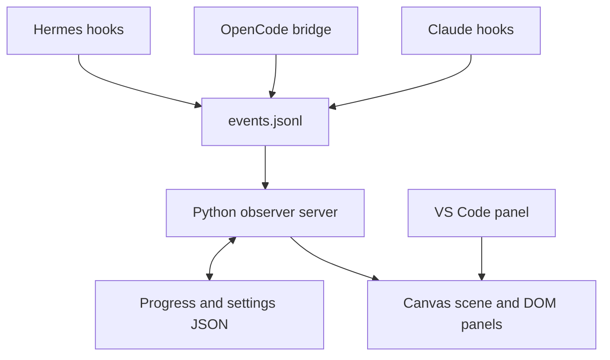

# Architecture

Agent Office is a local observer. Python handles event folding and persistence; the browser renders canvas and DOM. No database, bundler, agent executor, or model provider is required.

## Boundaries

| File | Responsibility |
|---|---|
| `run.py` | Standalone local server entry point |
| `demo_feed.py` | Isolated, explicitly synthetic example feed |
| `__init__.py` | Hermes callbacks, event validation/folding, HTTP routes, settings validation |
| `progress.py` | XP, achievements, idempotent event cursor, persisted progress |
| `claude/hook.py` | Claude stdin hook payload → normalized event |
| `opencode/index.js` | OpenCode event/plugin payload → normalized event |
| `install.py` | Preserve and extend existing runtime configuration |
| `web/js/icons.js` | Bundled accessible Lucide icon markup |
| `web/js/data.js` | Presentation constants, sprite-frame mapping, settings normalization, shared placement geometry |
| `web/js/scene.js` | Asset loading, camera, movement, scene drawing, hit testing |
| `web/js/office.js` | State polling, safe text rendering, panels, searches, shared settings transport |
| `web/js/editor.js` | Furniture catalog, move/select/remove, undo/redo, layout import/export |
| `vscode/extension.js`, `panel.js` | Single iframe frontend with a configurable, forwarded server URL |

## HTTP

| Method | Path | Purpose |
|---|---|---|
| GET | `/` | Frontend |
| GET | `/state` | Agents, last 30 events, progress, validated settings, live/demo marker |
| GET | `/settings` | Validated settings |
| POST | `/settings` | Partial settings update; JSON object, maximum 64 KiB |
| DELETE | `/state` | Reset progress/events; retain room settings |
| GET | `/assets-manifest` | Compatibility endpoint for bundled/user SVG inventory |
| GET | `/user/<name>.svg` | Optional user SVG |
| GET | `/js/*`, `/css/*`, `/assets/*` | Bundled static files with path containment |

Writes return JSON errors for malformed bodies, unsupported content types, oversized requests, and failed writes. Settings are whitelisted, typed, and atomically replaced. A process lock serializes state folds, settings saves, and resets; it is not a cross-process database lock. Runtime bridges append to the same event log.

The server starts independently for Claude/OpenCode, or lazily from Hermes. State is reconstructed from disk so sessions from separate processes can appear together. Invalid JSON lines, non-object events, and invalid timestamps are skipped. The progress cursor counts events sharing the same final timestamp without replaying them on the next poll. Legacy stores migrate without replaying the final event.

## Rendering

The canvas uses a device-pixel-ratio-aware transform and nearest-neighbor sampling. World geometry and text resolution are separate. All agent stations are laid out inside the room; mobile caps the initial view at two columns. Fit keeps the room in bounds; zoom permits dragging. Movement uses elapsed time, a bounded frame rate, aisle waypoints, and distance-based walk animation. Reading and typing use the correct source columns. Hidden tabs skip painting, and reduced-motion preferences pause animation without stopping network updates.

Both generated atlases are decoded once. Their quadrant bounds are found from alpha, trimmed, and sampled onto small logical sprite canvases. Desk geometry does not depend on image dimensions. The roster uses the same character sheets as the scene. Nameplates are drawn separately at native screen resolution using the local Geist font, with width-aware truncation and full names available in the roster. Dense rooms use single-line names to reserve space for approval alerts.

Placement previews and saves share the same floor, desk, default-decoration, and custom-prop bounds. The editor supports keyboard placement and 20 steps of in-session undo/redo. Moves commit only after collision validation; cancelled pointer gestures preserve the original prop. External layout changes clear stale selection and history. The aquarium uses the same bounds for rendering and collision. Each visible interactive cat has its own hit target, rebuilt each frame. Canvas geometry redraws immediately when the edit toolbar or viewport changes size. Normalized saved positions are clamped after reflow; existing layouts are not automatically rearranged.

Modal panels keep keyboard focus inside and return it when closed. Search inputs are persistent DOM nodes. Polling refreshes data containers without replacing typed text. All event-derived markup is escaped. Settings updates are queued, and pending edits are protected from stale polling responses.

## Deliberate scope

The task board groups observed sessions. There is no task-dispatch endpoint, autonomous hiring, chat memory, inference loop, or tool-execution service. The reference repositories use different architectures; their execution engines were not combined with this observer. Live third-party CLI installations and a real VS Code extension host still require integration testing in the user's environment.
