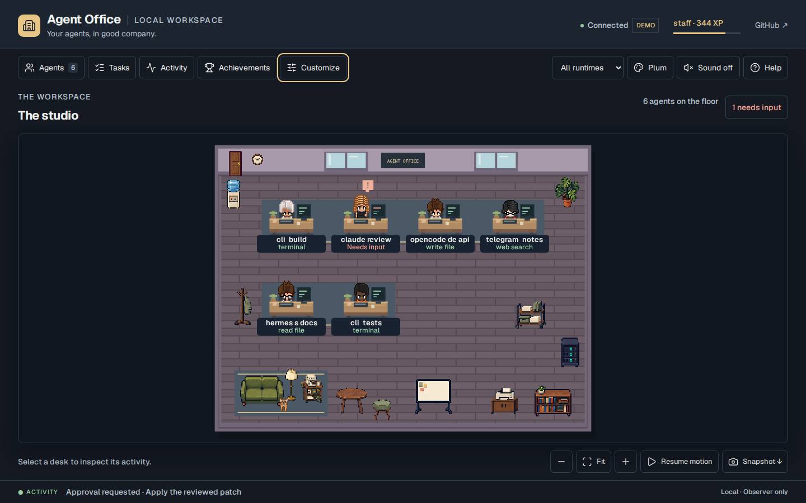
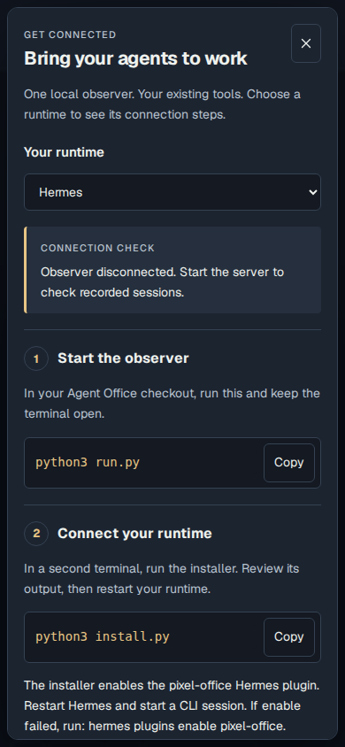
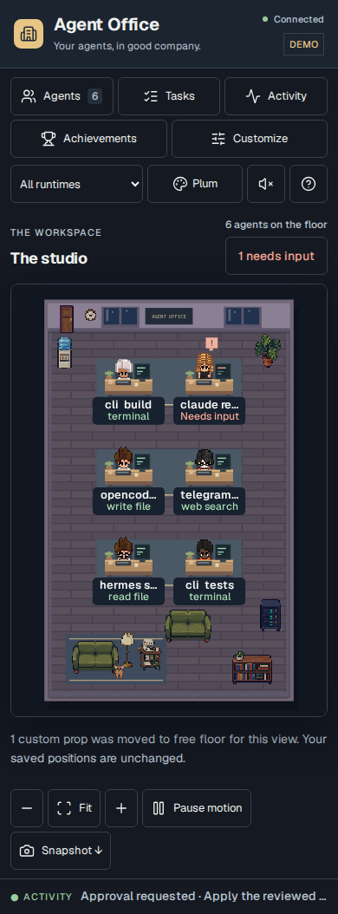

# Agent Office audit · 2026-10-07

This document separates current checks from historical browser evidence. All pictured sessions are synthetic; no image represents a live LLM run.

## Current browser, scene and tracking pass

### Changes in this pass

- Added a fourth generated furniture atlas: planning board, printer cabinet, supply cart and coat rack. All fifteen props have runtime previews, collision bounds, settings validation, placement, persistence and removal coverage. Original generated PNG bytes and exact prompt provenance are retained.
- Settings now reconcile confirmed server values with queued edits. A failed write rolls back its own change without discarding a newer queued edit. Undo/redo history changes only after successful persistence; failed Undo, Redo and imports remain retryable.
- Mobile Fit views allow vertical swipes through the floor to reach the controls below it. Zoomed views and furniture editing retain canvas gesture control. Tests send actual Chromium touch events and verify both page scrolling and canvas panning.
- Unchanged event logs reuse one private parsed snapshot. Appends, rewrites, replacement, deletion and changes during reading invalidate it. Full retained history stays available to the existing state fold; a proposed suffix cutoff was rejected after it hid a quiet pending approval during another agent's burst.

### Existing behavior rechecked

- First-run detection no longer mistakes this checkout’s Claude/OpenCode source folders or observer-only Hermes data for installed runtimes. The guide has a runtime selector, connection check, copyable commands and keyboard-accessible troubleshooting.
- Focused agent cards keep updating, moving between task groups and disappearing when sessions leave. Search matches the readable status/event names. Every waiting agent is reachable, and modals keep the background inert with visible focus recovery.
- Failed OpenCode tools finish through terminal tool parts even when the runtime skips its after hook. Duplicate terminal snapshots are bounded and deduplicated. Claude questions appear as needs-input events and clear on answer or denial, including legacy missing-call-ID denials. Late completions do not revive inactive avatars; Hermes parallel-call approval attribution stays local to its session.
- Custom props move to nearby free floor for each viewport without altering saved/exported positions. Drawing, walking, placement and selection share resolved bounds. Desk/nameplate clearance prevents hidden props, and unresolved props remain keyboard-removable with a visible notice. The narrow-room windows now clear the wall sign.
- Fifteen generated/attributed props have actual canvas placement, reload and removal coverage. Whole nameplates select agents; independent cat interactions, achievements, settings and menus are exercised.

| Check | Evidence |
| --- | --- |
| Python | 127 tests pass: lifecycle folding, concurrent tools/requests, hooks, installer, actual isolated HTTP server, API/settings, XP, assets and eleven new cache/history cases |
| Node | 33 tests pass: OpenCode payloads, geometry/paths/reflow, NPC cleanup, nameplate input and VS Code URL behavior |
| Browser | 40 Chromium user flows against the real Python server: all fifteen prop placements, mobile reflow/touch scrolling, failed and queued saves, retryable editor history, navigation, setup, focus, search, polling, reset, pets, achievements and downloads |
| Static | JavaScript syntax, Python compilation, Prettier and diff checks |
| Optional CPU renderer | Harness updated for fifteen loaded images. It was not rerun in this pass; retained `scene-*.png` files are preceding audit evidence. Current scene verification uses Chromium screenshots. |
| Assets | Complete PNG checksums, alpha/frame bounds and runtime-normalized props; generated source images are unchanged |
| Live runtimes | Documented payload fixtures and actual local hook/bridge file writes; installed provider CLI sessions and a VS Code extension host remain unverified |

The final browser run used Chromium 153 against a real isolated Python observer. Screenshots use synthetic events; no screenshot represents a live LLM run. No JavaScript page errors were recorded by the browser suite.

### Local unchanged-log benchmark

On a synthetic 10,000-record log (1,769,780 bytes), seven alternating samples of five warmed state requests measured a median **37.993 ms before** and **12.067 ms after** the cache change. This is about 3.15× for Python state construction on this execution host. It does not measure network/UI latency or continuously changing logs. The cache avoids re-reading and JSON parsing of unchanged files; the full state fold still runs.

| More evidence | Link |
| --- | --- |
| Baseline | [Original desktop](before-desktop.png), [original mobile](before-mobile.png), [asset inventory](assets-before.png) |
| Current interface | [Mobile workshop](workshop-mobile.png), [workshop catalog](workshop-catalog.png), [default mobile](mobile-studio.png), [settings](desktop-settings.png), [mobile settings](mobile-settings.png), [achievements](achievements.png), [midnight](midnight-studio.png) |
| Editor/rewards | [All fifteen props](furniture-placement.png), [move editor](furniture-editor.png), [room rewards](room-rewards.png) |

The optional CPU renderer is reproducible with a separately installed `skia-canvas` module: `SCENE_CANVAS_MODULE=/path/to/skia-canvas node tests/render-scene.cjs`. It writes `reports/scene-render`; the module is not a production dependency. Retained `scene-*.png` images document the preceding CPU-only pass, not current browser evidence.

## Reference and license decisions

| Reference | Direction adopted | Reuse boundary |
| --- | --- | --- |
| [Pixel Agents](https://github.com/pixel-agents-hq/pixel-agents) | Activity-linked animation, correct source columns, editable rooms and obstacle-aware movement | Existing attributed character/pet assets retained; new movement is independently implemented |
| [Sahni Agents Office](https://github.com/ajsahni/agents-office) | First-five-minutes instructions and explicit connection states | No code/art copied; noncommercial plus additional rebundling restrictions |
| [AgentSystemLabs](https://github.com/AgentSystemLabs/agent-office) | Initial setup and visible waiting-agent navigation | Independent observer implementation; its terminal execution engine was not imported |
| [Agent Virtual Office](https://github.com/KbWen/agent-virtual-office) | Truthful current activity and quiet-room wording | No fabricated task results or copied artwork |
| [Star Office UI](https://github.com/ringhyacinth/Star-Office-UI) | Setup verification and stale-session clarity | MIT code and noncommercial art are distinct; no art imported |
| [Harish Kotra AgentOffice](https://github.com/harishkotra/agent-office) | Task grouping and furniture placement | Observer-compatible concepts; no inference service imported |
| [thepixeloffice.ai](https://thepixeloffice.ai/) | Visual direction, researched with Firecrawl | No site artwork or unverified marketing claims imported |

Primary Claude hook and OpenCode v2 SDK documentation were checked through Context7/GitHub; Hermes approval context was checked in its source. MDN canvas/pointer guidance informed rendering and input handling. Generated prompts and source hashes are in [sprite provenance](../../web/assets/sprites/ATTRIBUTION.md).

## Remaining boundaries

The app observes; it does not hire agents, execute tasks, approve commands, connect a Telegram bot or dispatch messages. Runtime settings use standard paths, while `HERMES_HOME` sets the shared event directory and Hermes plugin location. Custom prop positions are resolved per view with a bounded search; if a crowded view has no suitable slot, the interface reports it while preserving the saved prop. Pets are decorative.

Claude/OpenCode logs can still grow on disk, and changed files still require a full read and fold. Hermes publisher trimming and the existing 30-minute expiry remain unchanged. The cache protects events present in the current file; it does not provide an archival event database or change those retention rules.

The existing progress cursor can undercount a distinct event appended later with an older timestamp. A timestamp of `200.2` followed by a newly appended `200.1` event reproduced that limitation; the cache does not change XP cursor semantics. Exact ingestion of out-of-order history needs a separate cursor/retention design.

The prior GitHub audit found CI manually disabled. The current connector rejects the workflow collection endpoint and cannot enable workflows; no hosted CI success is claimed. The existing workflow runs these local checks and uploads browser evidence when enabled. Runtime logs and test reports are ignored, and license/provenance documents are retained. Earlier images remain because they are validation evidence, not unused runtime assets.
