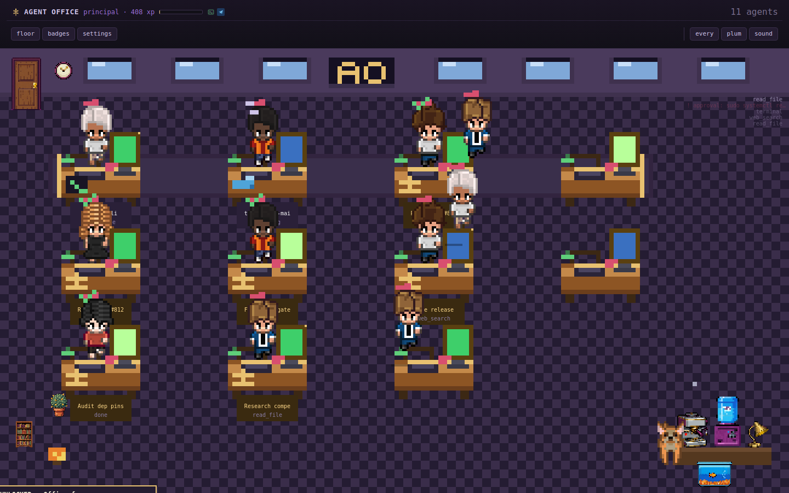
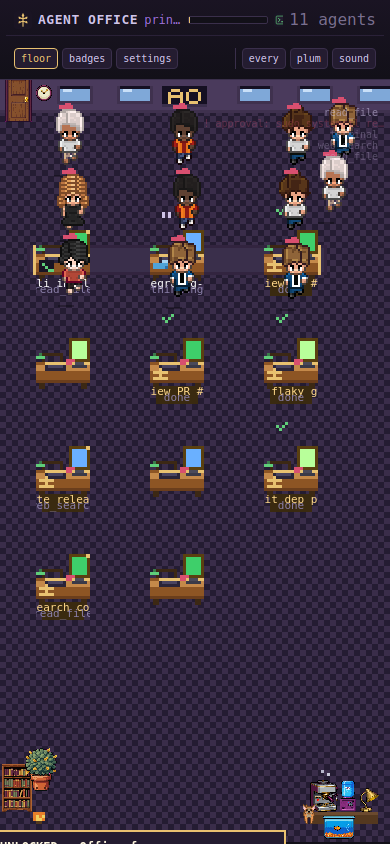
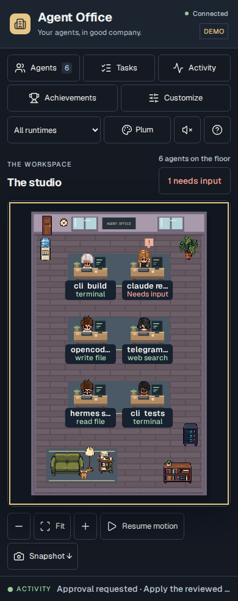
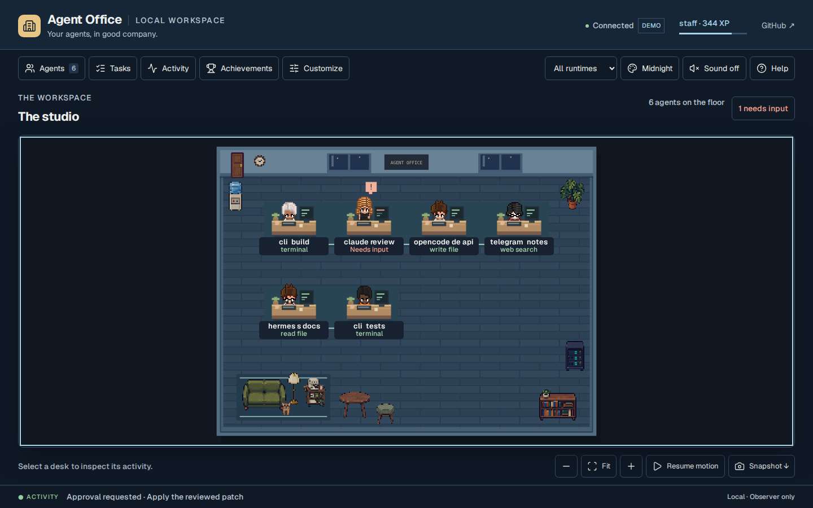
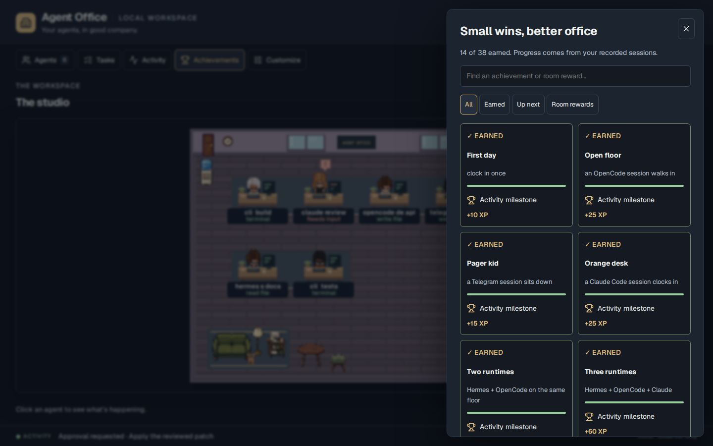
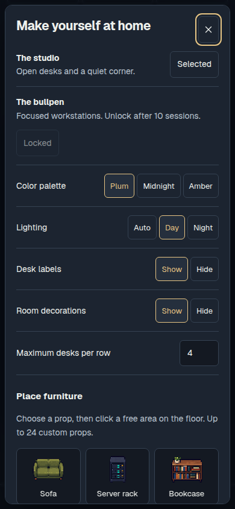

# Agent Office audit — 2026-10-03

Base: `35cf7fb`. The app was cloned, run locally, and exercised in a real
Chromium browser. Screenshots use synthetic events in a separate temporary
workspace. They do not show a live LLM session.

## Fixed findings

| Finding | Cause and correction |
|---|---|
| Settings ignored after reload | Frontend used `key in array` instead of a settings-key check. Shared typed settings normalization now applies server values. |
| Delayed polls undo saved settings | Polls now capture a settings revision; writes invalidate requests started before or during the save. |
| Focused settings show stale selection | Settings and layout controls persist, synchronize their pressed state in place, and retain keyboard focus. |
| Search loses focus after one character | Roster and event inputs were rebuilt during input/poll callbacks. Inputs are now persistent DOM nodes. |
| Event text executes as HTML | Agent details were concatenated into raw markup. All event-derived text is escaped. A browser regression demonstrated the old injection. |
| Glitching walk cycles | Six columns were assumed to be walk frames. Upstream mapping confirms three walk, two typing, and two reading columns. |
| Giant agents, tiny props, clipped mobile desks | Sprite scale, grid scale, and viewport fitting disagreed. World geometry, sprite sizing, and text scale are now separate. |
| Settings/API corruption | Non-object JSON and invalid types were accepted. Values are validated; HTTP failures return JSON status codes. |
| Corrupt log interrupts the office | Scalar JSON, invalid event names, and nonnumeric timestamps entered the fold. Invalid records are skipped, and activity rendering has a defensive fallback. |
| Same-timestamp events lose XP | Progress only tracked a timestamp. A boundary multiset now counts newly appended events at that timestamp without replay. |
| Theme achievement never advances standalone | Relative import failed outside plugin loading. Both standalone and package imports work. |
| Incorrect achievement thresholds | Fish unlocked at 15 rather than 25 browsing calls; plants unlocked with no session; earned time badges displayed 0%. Corrected and tested. |
| Removed features still advertised | Retired area/paint achievements, no-op cosmetics, unused sprites, and old settings were removed. Earned history and XP are retained. |
| VS Code page has missing assets | Installer copied the web template without CSS/JS. It now installs the iframe wrapper and helper module; the configured port is used. |
| Paths with spaces break Claude hook | Installer built an unquoted shell command. It now quotes executable and script paths. |
| Demo contaminates real progress | Demo now always runs in a temporary workspace and advertises its synthetic mode on port 8114. |
| CI only runs manually | One bounded CI job now runs for PRs/main code changes with read-only permissions, pinned actions, and three-day screenshot retention. |

## Added and reorganized

The scene is separated from application state and panel rendering. New UI
includes an observed-task overview, accessible modal focus management,
visible activity/help controls, a searchable event stream, settings
export/import, four placeable generated props, zoom/drag/fit, pause,
reduced-motion support, and scene downloads. Achievements have earned and
up-next filters. The frontend remains vanilla JavaScript with no build step.

## Reference research

- [Pixel Agents](https://github.com/pixel-agents-hq/pixel-agents): studied its README, character state machine, and sprite mapping. Adopted the activity-linked animation and shared frontend principles; used the correct atlas columns. This project already bundled adapted character/pet assets.
- [Harish Kotra's AgentOffice](https://github.com/harishkotra/agent-office): reviewed its task-board, focus, layout-editor, and activity-log concepts. Implemented observer-compatible task grouping and furniture placement. Its inference/tool-execution engine was not imported.
- [thepixeloffice.ai](https://thepixeloffice.ai/): inspected the landing page with Firecrawl for visual direction. Marketing claims were not treated as evidence of functioning integrations; no site artwork was copied.
- [VS Code remote-extension guidance](https://code.visualstudio.com/api/advanced-topics/remote-extensions): queried through Context7; used `asExternalUri` for the iframe and matched its CSP origin.
- [GitHub's Ubuntu 24.04 image](https://github.com/actions/runner-images/blob/main/images/ubuntu/Ubuntu2404-Readme.md): verified maintained Chrome availability for CI.

## Validation

- Python suite: **44 passing tests**.
- Node suites: OpenCode bridge event writes, VS Code URL/iframe behavior, and sprite-frame selection.
- Browser suite: **16 passing cases** against an actual Python HTTP server with an isolated data directory. Covers saved settings, delayed poll responses, focused controls, malformed event names, search focus, unsafe-text rendering, assets, mobile bounds, activity/task inspection, layout import/export, furniture placement, zoom, pause, snapshot downloads, achievements, malformed requests, invalid imports, disconnection/recovery, and confirmed reset. The screenshot case writes evidence when `OFFICE_SCREENSHOTS` is set, as it is in CI.
- JavaScript syntax, formatter check, and `git diff --check` passed.
- Visual review: desktop, 390px mobile, settings, achievements, and midnight palette. Additional bounds checks cover 320px, 768px, and 1440px widths.

The current Playwright browser CDN returned invalid archives in this
workspace. Local browser verification used an installed Chromium 134 via
`CHROMIUM_PATH`, driven by Playwright 1.63.0. CI uses the runner's maintained
Google Chrome. Real third-party CLI sessions and a VS Code extension host
were not launched. Custom props use normalized positions and may need
repositioning after major layout changes. This is a local observer, not an
autonomous agent execution platform.

## Screenshots

| Before | After |
|---|---|
|  |  |
|  |  |

