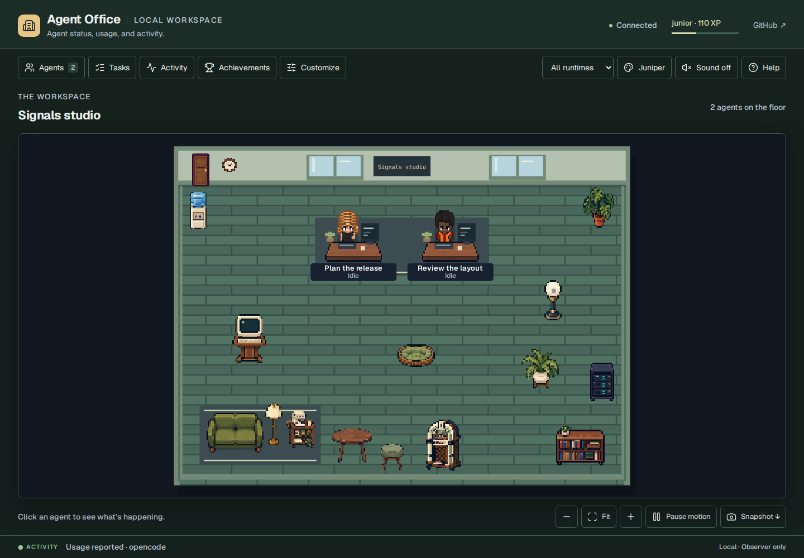

# Validation and integration limits

This document describes Agent Office 0.5.0's verification scope and release evidence. The screenshots and browser fixtures use synthetic activity in isolated data directories. They demonstrate the interface and observation path; they do not represent live model sessions.

## Interface evidence

| View | Screenshot |
| --- | --- |
| Aquarium | [Fish selection and feeding](../screenshots/aquarium.png) |
| Usage | [Reported counters and coverage](../screenshots/usage.png) |
| Settings | [Desk, pet, and saved-choice controls](../screenshots/settings.png) |
| Personalization | [Individual desk and character preferences](../screenshots/personalization.png) |
| Appearance | [Juniper, walnut desks, and a delegated robot](../screenshots/appearance.png) |
| Product website | [Responsive product introduction](../screenshots/product-site.png) |
| New interactive props | [Desktop](../screenshots/signals.png) and [320-pixel mobile reflow](../screenshots/signals-mobile.png) |
| Pet bed | [Cat resting at the placed bed](../screenshots/pet-bed.png) |
| Gemini lifecycle | [Mobile inspector with a synthetic hook fixture and unreported usage](../screenshots/gemini-mobile.png) |

See [the preview guide](../preview.md) for the demonstration and [CONTRIBUTING.md](../../CONTRIBUTING.md) to reproduce local browser checks.

## Automated coverage

| Layer | What the tests exercise | Main evidence |
| --- | --- | --- |
| Event durability | Out-of-order source timestamps, identical event publications, competing consumers, failures before/after commit, receipt cleanup, and raw count/age/byte retention | [`test_event_store.py`](../../tests/test_event_store.py), [`test_event_inbox.py`](../../tests/test_event_inbox.py) |
| Settings integrity | Required revisions, stale full-map conflicts, cooperating process concurrency, preserved malformed files, oversized numbers, repair, and suspension of pruning while retention settings are unavailable | [`test_settings_concurrency.py`](../../tests/test_settings_concurrency.py), [`settings-concurrency.test.cjs`](../../tests/settings-concurrency.test.cjs) |
| Storage health | Fair durable retries, publisher ordering, acknowledged cleanup, temporary/legacy bytes, unavailable measurements, exact usage-record counts, and legacy I/O recovery | [`test_storage_health.py`](../../tests/test_storage_health.py), [`test_event_cache.py`](../../tests/test_event_cache.py) |
| Physical maintenance | Exact rows and correction baselines through compaction, pending reset/inbox preservation, DELETE/WAL exclusion, busy exits, unknown measurements, and altered/generated schema rejection | [`test_storage_maintenance.py`](../../tests/test_storage_maintenance.py) |
| Reset recovery | Recovery after publishing a reset intent, post-commit cleanup failures, late old-epoch writes, pending reset reads, and concurrent legacy appends | [`test_reset_protocol.py`](../../tests/test_reset_protocol.py) |
| Lifecycle | Parallel calls, independent unanswered prompts, real child-session IDs, duplicate terminal events, late orphan completions, quiet-state context, and session expiry | [`test_state_model.py`](../../tests/test_state_model.py), [`test_agent_lifecycle.py`](../../tests/test_agent_lifecycle.py) |
| Usage | Stable identities, duplicate snapshots, corrections, missing/invalid fields, token subsets, cost coverage, overflow handling, and history/reset boundaries | [`test_usage.py`](../../tests/test_usage.py), [`test_event_store.py`](../../tests/test_event_store.py) |
| Runtime adapters | Provider-shaped fixtures through actual local hook processes or the OpenCode plugin, immutable publication, and SQLite consumption | [`test_runtime_adapters.py`](../../tests/test_runtime_adapters.py), [`test_codex_hook.py`](../../tests/test_codex_hook.py), [`test_codex_stream.py`](../../tests/test_codex_stream.py), [`test_hermes_usage.py`](../../tests/test_hermes_usage.py), [`opencode-bridge.test.mjs`](../../tests/opencode-bridge.test.mjs) |
| Gemini CLI | Four-hook lifecycle mapper, bounded silent input, real official CLI success/error flows with synthetic local responses, source closing-hook omissions, quiet/expiry behavior, and truthful browser coverage | [`test_gemini_hook.py`](../../tests/test_gemini_hook.py), [`test_gemini_native.py`](../../tests/test_gemini_native.py), [`gemini-browser.test.cjs`](../../tests/gemini-browser.test.cjs) |
| Reported task lists | Valid full snapshots, explicit clearing, atomic invalid-input rejection, stable source/receipt times, eight-capture replay memory, restart, source adapters, historical rows, and unchanged XP/lifecycle | [`test_tasks.py`](../../tests/test_tasks.py), [`test_tasks_integration.py`](../../tests/test_tasks_integration.py), [`tasks-view.test.cjs`](../../tests/tasks-view.test.cjs), [`settings-concurrency.test.cjs`](../../tests/settings-concurrency.test.cjs) |
| Installation | Runtime detection, additive configuration, malformed configuration preservation, copied Hermes imports/observation without the source checkout, optional hooks, trust boundaries, and extension file selection | [`test_install_config.py`](../../tests/test_install_config.py), [`test_audit_regressions.py`](../../tests/test_audit_regressions.py) |
| Achievements | All 37 catalog conditions are reachable; retired records disappear while earned XP, statistics, and existing lamps remain; errors, time of day, and theme changes award no XP; aliases do not inflate runtime counts | [`test_progress.py`](../../tests/test_progress.py), [`test_layout_unlocks.py`](../../tests/test_layout_unlocks.py), [`test_event_store.py`](../../tests/test_event_store.py), [`test_audit_regressions.py`](../../tests/test_audit_regressions.py) |
| Browser and scene | Real local HTTP routes, polling, disconnected states, furniture/editor persistence, failed queued saves, touch scrolling, focus, search, reset, assets, and downloads | [`browser.test.cjs`](../../tests/browser.test.cjs), [`scene-model.test.cjs`](../../tests/scene-model.test.cjs), [`product-ui.test.cjs`](../../tests/product-ui.test.cjs) |
| Editor acknowledgements | Pending move feedback, actual transport failure and stale revision rollback, external furniture replacement, and Done/Escape during a pending save | [`editor-feedback.test.cjs`](../../tests/editor-feedback.test.cjs) |
| Appearance | All 21 compiled robot poses, roster consistency, grounded crowns, real walk frames/facing in both layouts, desk finishes, save recovery, unlock gates, transformed canvas clicks, and responsive collision bounds | [`appearance.test.cjs`](../../tests/appearance.test.cjs) |
| Personalization | Canonical-ID desk and character preferences, atomic validation, occupied-seat rejection, deterministic conflicts, stable automatic homes, native save/rollback, filtering and responsive layouts, persistence without fabricated activity | [`personalization.test.cjs`](../../tests/personalization.test.cjs), [`personalization-browser.test.cjs`](../../tests/personalization-browser.test.cjs), [`test_personalization.py`](../../tests/test_personalization.py) |
| HUD | Visible close controls, preserved scroll and inspector return context, selected history text across polling, contained mobile scrolling, deduplicated notices, safe view persistence, and per-agent usage coverage | [`hud.test.cjs`](../../tests/hud.test.cjs) |
| Pets | Bounded movement, collision clearance, idle approaches and active-work avoidance, sleep, click targets, reflow, pause, visibility, and reduced-motion behavior | [`pets.test.cjs`](../../tests/pets.test.cjs), [`pets-browser.test.cjs`](../../tests/pets-browser.test.cjs) |
| Follow camera | Native follow/stop, panel retention, manual pan/Fit/filter/edit cancellation, and release after actual session-end ingestion and sprite fade | [`scene-model.test.cjs`](../../tests/scene-model.test.cjs), [`follow-camera.test.cjs`](../../tests/follow-camera.test.cjs) |
| Interactive props and beds | Native placement/actions/reload, exact sprite pixels, mobile collisions, connected waiting-only beacon, frozen overlays, normal pet motion, accelerated bed arrival, and moved/removed-bed release | [`signals-browser.test.cjs`](../../tests/signals-browser.test.cjs) |
| Aquarium and music | Fish movement/feeding limits, unlocks, preferences, optional art validation, gesture-started audio, voice cleanup, and muted/hidden behavior | [`aquarium.test.cjs`](../../tests/aquarium.test.cjs), [`jukebox-model.test.cjs`](../../tests/jukebox-model.test.cjs), [`room-interactions.test.cjs`](../../tests/room-interactions.test.cjs), [`test_smallburg_import.py`](../../tests/test_smallburg_import.py) |
| Public preview | Isolated fixture generation, static build boundaries, synthetic markers, reset/history/preferences, exact-byte concurrency guards for legacy preferences, and exclusion of local data and optional commercial art | [`test_preview_build.py`](../../tests/test_preview_build.py), [`preview.test.cjs`](../../tests/preview.test.cjs) |
| Product website | Allowlisted public build, safe regeneration, relative paths, real desktop/mobile browser flows, keyboard tabs, actual clipboard and denied-clipboard recovery, reduced motion and no-JavaScript content | [`test_site_build.py`](../../tests/test_site_build.py), [`site.test.cjs`](../../tests/site.test.cjs) |
| VS Code view | URL validation, actual local HTTP probes, cancellation/race handling, command boundaries, and panel lifecycle | [`vscode-panel.test.cjs`](../../tests/vscode-panel.test.cjs): 11 focused tests passed in this validation environment |

Run the repository's Python, Node, syntax, formatting, and browser commands together before release. The [CI workflow](../../.github/workflows/ci.yml) defines the same checks and captures browser artifacts. A configured workflow is not evidence of a hosted run; consult the pull request's actual check results for its commit. This document does not carry forward test totals or benchmarks from an older implementation.

### Verified 0.5.0 maintenance update

The integrated local run on 8 October 2026 (UTC) used Python **3.12.14**,
Node **24.19.0**, and Chromium **153.0.8010.0**. CI and Vercel are configured
for Node 22; local tests do not establish a hosted CI result.

| Command or flow | Result |
| --- | --- |
| `GEMINI_TEST_CLI=... python -m pytest -q -o addopts=''` | **520 passed**, including both native CLI cases; 15.88 seconds |
| `npm test` | **101 passed** |
| `npm run test:browser` | **169 passed**, 0 failed, 1 optional local-art check skipped; 81.06 seconds |
| `npm run check` | Passed |
| `npm run format:check` and `git diff --check` | Passed |
| `npm run build:preview` | Built 62 public demo files and 20 product-site files; no local runtime data or Smallburg source sheets |
| Official `@vscode/vsce` 4.0.0 packaging | Passed; eight expected VSIX entries, 11,505 bytes; manifest and runtime files match source |

Without `GEMINI_TEST_CLI`, the two native cases skip; their eight isolation
guards still run. The native cases use the actual official Gemini CLI 0.63.0
and installed observer command with an explicit synthetic loopback provider.
Success emits start/busy/idle/end. The tested provider-error path emits only
start/busy; after five minutes the UI marks that observation quiet, and after
30 minutes the ordinary stale limit removes it. XP and all progression
statistics remain unchanged through those presentation changes. This does
not establish interactive or paid-provider behavior.

The copied-Hermes regressions first reproduced a missing `settings_store`
import. Both an existing copied install and the no-symlink fallback now load
from an isolated Python process, save settings, publish an observation, and
consume it through SQLite without importing the source checkout.

The new maintenance tests verify exact table rows and replay/correction
baselines before and after rebuilding fragmented storage. They preserve
pending reset intents, new-epoch inbox files, unresolved approvals, tasks,
receipts, and retries. Competing readers/writers in both DELETE and WAL mode
produce bounded busy failures. Altered keys and generated columns are rejected
without changing the database bytes. Physical compaction is explicit; it does
not shorten retention or remove accounting identities.

Real-server Chromium flows reproduce and verify pending furniture moves,
transport failures, actual stale-revision conflicts, replacement layouts,
Done/Escape while saving, and en-CA timestamps. Legacy demo preferences use
exact stored bytes to reject stale full-map writes from another view. The
Gemini browser test follows actual hook publication through the observer,
checks filters and reload persistence, and verifies the 320-pixel inspector
shows absent usage as **Not reported**. Its screenshot is labeled synthetic.

Independent reviews found and closed the generated-column guard, malformed
Gemini hook-group preservation, inherited system-configuration risk in native
tests, and a Node preload path-space failure. Native fixtures now refuse
existing or unverifiable system policy and always exercise paths with spaces.
The reviews found no remaining blocker in this change's scope.

The complete browser gate also retains coverage for aquarium feeding/unlocks,
audio playback and cleanup, character frames/facing, collisions, pet beds,
follow controls, panel persistence, keyboard/focus/scroll behavior, and the
responsive product website. The optional commercial fish-sheet browser check
was skipped in this run; original public aquarium artwork was exercised.

[The hosted-review guide](../preview.md#hosted-review) explains deployment
verification. Vercel's static build is separate from Python, Node, and browser
tests. The repository's GitHub CI workflow remains manually disabled; the
connected tools cannot administer that setting. GitHub Pages also remains
disabled. No replacement workflow or access-setting change was used to bypass
those configurations. Consult the current pull request for exact deployed
commit and hosted review results.

## Integration limits

**Native coverage is specific to each runtime.** The official Gemini CLI 0.63.0 executed the installed observer hook in isolated runs with synthetic local success and error responses. Those checks establish CLI/config/hook delivery, not paid-provider behavior or a user's interactive setup. Hermes, Claude Code, Codex, and OpenCode executables remained unavailable. Their tests exercise adapter contracts and actual publication, SQLite ingestion, HTTP, and browser paths using fixtures. Copied Hermes plugin installation now also loads and observes from an isolated Python process without the source checkout. [Runtime coverage](../runtime-observers.md) identifies each adapter's source contract and remaining host checks.

**VSIX packaging passed; the extension host remains unverified.** The pinned official `@vscode/vsce` 4.0.0 tool successfully packaged the eight expected VSIX entries with no runtime npm dependencies. `/usr/local/bin/code` was a launcher shim with no installed VS Code executable. The official `@vscode/test-electron` 3.1.0 stable-runtime download timed out after 15 seconds; Xvfb was absent and the environment rejected the package manager's required UID/group operations. The 11 extension tests use real local HTTP requests and a simulated VS Code API. Actual installation, activation, remote forwarding, and authentication handoff require a working VS Code host. Packaging success does not establish them.

**Usage is observed coverage.** Claude hooks and the Gemini lifecycle adapter supply no usage counters. Supported Hermes hooks cover main-loop API attempts, and Codex usage requires the documented captured-stream path. OpenCode's monetary field is a runtime estimate; reported zero can reflect missing runtime pricing. Missing metrics remain unknown. A differing old usage snapshot without a revision is indistinguishable from a correction.

**Retention has explicit boundaries.** The default 1,000-event / seven-day / 5-MiB limit applies to raw activity. Live unresolved prompts and compact accounting survive pruning. Automatic pruning pauses when retention settings are unavailable. Usage identities grow with unique observed units, offline inbox files wait for the server, and legacy JSONL files remain read-only. Arbitrary legacy rewrites lack the stable identity guarantees of new publishers. See [storage and reset design](../architecture.md).

**Task lists preserve source statements.** A completed session does not establish that every reported task finished. Recent known Codex capture replays are suppressed by bounded per-board memory; unseen or evicted captures have no shared source clock and follow receipt order. A board evicted from the 128-board collection loses that replay memory. OpenCode's inspected TODO payload has no source-update timestamp, so the UI labels receipt time separately.

**Settings concurrency covers cooperating local servers.** Tests cover processes sharing the same local SQLite lock and injected I/O failures. They do not prove power-loss durability, network-filesystem locking, or atomicity against arbitrary external editors racing the final file replacement.

**Optional commercial art is local.** The public aquarium uses original bundled artwork. The Smallburg importer validates an existing licensed Little Current checkout and installs outside this repository; it does not fetch, license, or publish the commercial source files. [The import guide](../aquarium-assets.md) records exact sources, hashes, frame selection, and license boundaries.

## Source and asset review

[The reference review](../reference-review-2026-10-07.md) records inspected repositories, primary runtime documentation, and what can be adopted by a local observer. It covers Pixel Agents and Hootbu's fork, Harish Kotra's AgentOffice, AgentSystemLabs, thepixeloffice.ai, Claw3D, Termi, the supplied LinkedIn prototype, and SVGL's AI marks.

Provider normalization, readable status grouping, editable rooms, and separate temporary animation cues are compatible concepts. Autonomous dispatch, agent hiring, model execution, and permission decisions are outside this product. No feature claim is inherited merely because it appears in a reference project's README or marketing page.

MIT code notices, separately licensed artwork, generated-art provenance, and trademark attribution are kept distinct. Noncommercial or restricted artwork is not included based solely on an open repository. Consult [sprite provenance](../../web/assets/sprites/ATTRIBUTION.md), [font, icon, and runtime mark credits](../../web/assets/ATTRIBUTION.md), and [optional aquarium art](../aquarium-assets.md) for the shipped assets.
