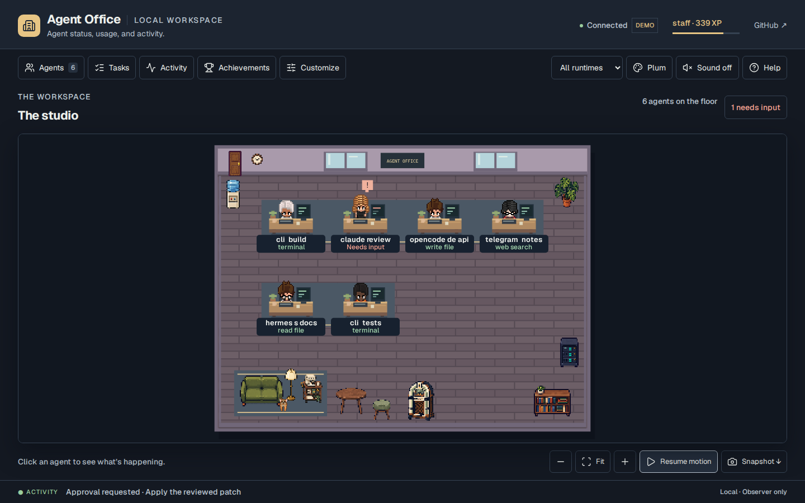

# Validation and integration limits

This document describes Agent Office 0.5.0's verification scope and release evidence. The screenshots and browser fixtures use synthetic activity in isolated data directories. They demonstrate the interface and observation path; they do not represent live model sessions.

## Interface evidence

| View | Screenshot |
| --- | --- |
| Aquarium | [Fish selection and feeding](../screenshots/aquarium.png) |
| Usage | [Reported counters and coverage](../screenshots/usage.png) |
| Settings | [Room and retention controls](../screenshots/settings.png) |

See [the preview guide](../preview.md) for the demonstration and [CONTRIBUTING.md](../../CONTRIBUTING.md) to reproduce local browser checks.

## Automated coverage

| Layer | What the tests exercise | Main evidence |
| --- | --- | --- |
| Event durability | Out-of-order source timestamps, identical event publications, competing consumers, failures before/after commit, receipt cleanup, and raw count/age/byte retention | [`test_event_store.py`](../../tests/test_event_store.py), [`test_event_inbox.py`](../../tests/test_event_inbox.py) |
| Reset recovery | Recovery after publishing a reset intent, post-commit cleanup failures, late old-epoch writes, pending reset reads, and concurrent legacy appends | [`test_reset_protocol.py`](../../tests/test_reset_protocol.py) |
| Lifecycle | Parallel calls, independent unanswered prompts, real child-session IDs, duplicate terminal events, late orphan completions, quiet-state context, and session expiry | [`test_state_model.py`](../../tests/test_state_model.py), [`test_agent_lifecycle.py`](../../tests/test_agent_lifecycle.py) |
| Usage | Stable identities, duplicate snapshots, corrections, missing/invalid fields, token subsets, cost coverage, overflow handling, and history/reset boundaries | [`test_usage.py`](../../tests/test_usage.py), [`test_event_store.py`](../../tests/test_event_store.py) |
| Runtime adapters | Provider-shaped fixtures through actual local hook processes or the OpenCode plugin, immutable publication, and SQLite consumption | [`test_runtime_adapters.py`](../../tests/test_runtime_adapters.py), [`test_codex_hook.py`](../../tests/test_codex_hook.py), [`test_codex_stream.py`](../../tests/test_codex_stream.py), [`test_hermes_usage.py`](../../tests/test_hermes_usage.py), [`opencode-bridge.test.mjs`](../../tests/opencode-bridge.test.mjs) |
| Installation | Runtime detection, additive configuration, malformed configuration preservation, optional hooks, Codex trust boundaries, and extension file selection | [`test_install_config.py`](../../tests/test_install_config.py), [`test_audit_regressions.py`](../../tests/test_audit_regressions.py) |
| Achievements | All 44 catalog conditions are reachable; retired records disappear without changing earned XP/statistics; aliases do not inflate runtime counts | [`test_progress.py`](../../tests/test_progress.py), [`test_layout_unlocks.py`](../../tests/test_layout_unlocks.py) |
| Browser and scene | Real local HTTP routes, polling, disconnected states, furniture/editor persistence, failed queued saves, touch scrolling, focus, search, reset, assets, and downloads | [`browser.test.cjs`](../../tests/browser.test.cjs), [`scene-model.test.cjs`](../../tests/scene-model.test.cjs), [`product-ui.test.cjs`](../../tests/product-ui.test.cjs) |
| Aquarium and music | Fish movement/feeding limits, unlocks, preferences, optional art validation, gesture-started audio, voice cleanup, and muted/hidden behavior | [`aquarium.test.cjs`](../../tests/aquarium.test.cjs), [`jukebox-model.test.cjs`](../../tests/jukebox-model.test.cjs), [`room-interactions.test.cjs`](../../tests/room-interactions.test.cjs), [`test_smallburg_import.py`](../../tests/test_smallburg_import.py) |
| Public preview | Isolated fixture generation, static build boundaries, synthetic markers, reset/history/preferences, and exclusion of local data and optional commercial art | [`test_preview_build.py`](../../tests/test_preview_build.py), [`preview.test.cjs`](../../tests/preview.test.cjs) |
| VS Code view | URL validation, actual local HTTP probes, cancellation/race handling, command boundaries, and panel lifecycle | [`vscode-panel.test.cjs`](../../tests/vscode-panel.test.cjs): 11 focused tests passed in this validation environment |

Run the repository's Python, Node, syntax, formatting, and browser commands together before release. The [CI workflow](../../.github/workflows/ci.yml) defines the same checks and captures browser artifacts. A configured workflow is not evidence of a hosted run; consult the pull request's actual check results for its commit. This document does not carry forward test totals or benchmarks from an older implementation.

### Verified 0.5.0 release candidate

The integrated local run on 7 October 2026 used Python **3.12.14**, Node
**24.19.0**, and Chromium **153.0.8010.0**. The configured CI Node version is 22;
the local run is not evidence of that separate environment.

| Command or flow | Result |
| --- | --- |
| `python -m pytest -q -o addopts=''` | 293 passed |
| `npm test` | 50 passed |
| `npm run test:browser` | 80 passed, 0 failed, 1 optional local-art check skipped |
| Optional local-art browser check with the verified Smallburg pack | 1 passed; all four fish decoded their four native frames |
| `npm run check` and `npm run format:check` | Passed |
| `npm run build:preview` | Built 52 public files; no local runtime data or Smallburg sheets |

The music tests measured nonzero waveforms from a native `AnalyserNode` for
all three tracks, then checked actual audio-context cleanup. The browser suite
also covers settings failure/retry, queued writes, two-tab demo reset/history
behavior, grouped unlock notices, quiet-agent inspection, and 320-pixel layouts.
The four screenshots above come from the integrated public-fixture run.

## Integration limits

**Installed runtime sessions remain unverified here.** Hermes, Claude Code, Codex, and OpenCode executables were unavailable in this environment. Tests exercised their adapter contracts and the real local publisher → inbox → database → HTTP/browser path using fixtures. A user-environment check must still confirm that the installed runtime version emits those payloads and successfully loads its configuration. [Runtime coverage](../runtime-observers.md) identifies adapter-specific capabilities and source contracts.

**The VS Code extension host was unavailable.** `/usr/local/bin/code` was a launcher shim whose version check reported that VS Code/Code Insiders was not installed. The 11 extension tests include real local HTTP requests and a simulated VS Code API, not a running extension host. Remote forwarding, workspace-host installation, and authentication handoff therefore need an actual VS Code environment. Packaging through the pinned official `@vscode/vsce` tool was attempted, but dependency download was blocked by the execution environment's network policy. No successfully packaged or installed VSIX is claimed by this audit.

**Usage is observed coverage.** Claude hooks supply no usage counters. Supported Hermes hooks cover main-loop API attempts, and Codex usage requires the documented captured-stream path. OpenCode's monetary field is a runtime estimate; reported zero can reflect missing runtime pricing. Missing metrics remain unknown. A differing old usage snapshot without a revision is indistinguishable from a correction.

**Retention has explicit boundaries.** The default 1,000-event / seven-day / 5-MiB limit applies to raw activity. Live unresolved prompts and compact accounting survive pruning. Usage identities grow with unique observed units, offline inbox files wait for the server, and legacy JSONL files remain read-only. Arbitrary legacy rewrites lack the stable identity guarantees of new publishers. See [storage and reset design](../architecture.md).

**Optional commercial art is local.** The public aquarium uses original bundled artwork. The Smallburg importer validates an existing licensed Little Current checkout and installs outside this repository; it does not fetch, license, or publish the commercial source files. [The import guide](../aquarium-assets.md) records exact sources, hashes, frame selection, and license boundaries.

## Source and asset review

[The reference review](../reference-review-2026-10-07.md) records inspected repositories, primary runtime documentation, and what can be adopted by a local observer. It covers Pixel Agents, Harish Kotra's AgentOffice, AgentSystemLabs, thepixeloffice.ai, Claw3D, the supplied LinkedIn prototype, and SVGL's AI marks.

Provider normalization, readable status grouping, editable rooms, and separate temporary animation cues are compatible concepts. Autonomous dispatch, agent hiring, model execution, and permission decisions are outside this product. No feature claim is inherited merely because it appears in a reference project's README or marketing page.

MIT code notices, separately licensed artwork, generated-art provenance, and trademark attribution are kept distinct. Noncommercial or restricted artwork is not included based solely on an open repository. Consult [sprite provenance](../../web/assets/sprites/ATTRIBUTION.md), [font, icon, and runtime mark credits](../../web/assets/ATTRIBUTION.md), and [optional aquarium art](../aquarium-assets.md) for the shipped assets.
