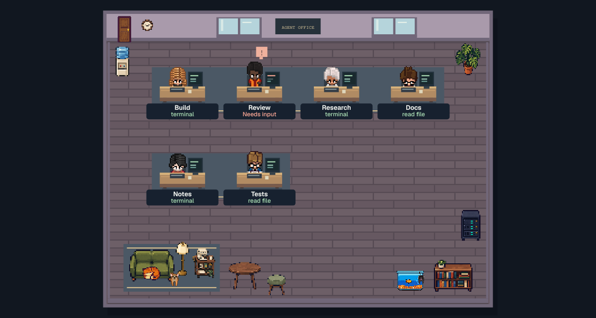
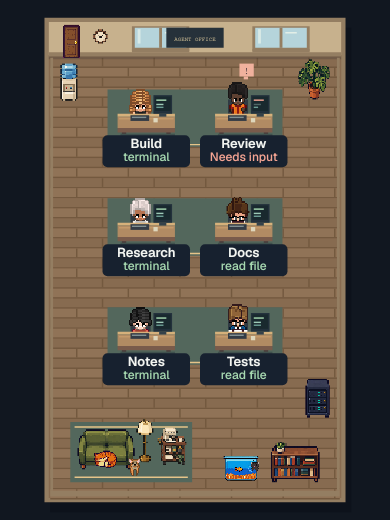
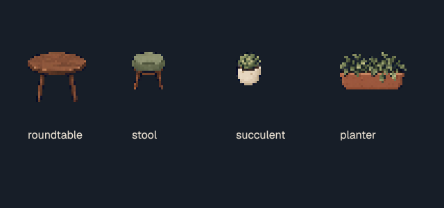

# Agent Office audit · 2026-10-03

This document separates current checks from historical browser evidence. All pictured sessions are synthetic; no image represents a live LLM run.

## Current scene and tracking pass

- Tool completion, idle, errors and departure clear stale tool text and animation. Call IDs preserve parallel tools and independent pending permission/question requests.
- Claude child tool events retain child attribution. OpenCode follows actual child session IDs, titles, busy/idle/error states and question events instead of creating duplicate task avatars. Hermes approval fallback uses per-session context.
- Installer creates missing JSON settings, preserves unrelated hooks, private modes and symlinks, repairs legacy OpenCode bridge paths and dangling Hermes links, and reports write failures without abandoning other integrations. JSONC is preserved with explicit manual instructions.
- Eleven placeable props share rendering and collision sizes. A new generated cafe/plant atlas adds a table, stool, succulent and planter; desktop lounge tables use the same bounds for drawing and navigation.
- Arrival paths avoid other desks and props using feet-level collision. Existing sessions start seated. Planning is limited to two arrivals per frame; rooms above 16 sessions and relayout use seated arrivals. This keeps tracking uncapped without blocking on hundreds of routes.
- Human status/event labels and needs-input notifications describe recorded work. Approval and question responses belong in the original runtime.

| Check | Evidence |
| --- | --- |
| Python | 97 tests pass: lifecycle folding, concurrent tools/requests, hooks, installer, API/settings, XP and assets |
| Node | 23 tests pass: OpenCode payloads, geometry/paths, NPC cleanup and VS Code URL behavior |
| Static | JavaScript syntax, Python compilation, Prettier and diff checks |
| Scene renderer | Actual asset loader and draw loop in a CPU canvas: 14 assets, desktop/mobile/night, arrivals reach desks, two-route budget, 128-session bootstrap/relayout without path work |
| Assets | Unmodified RGBA source, alpha and four normalized cells inspected; complete PNG checksums retained |
| Browser DOM/userflows | **Not rerun for this pass.** Chromium's required socket is denied by this execution session; escalation is disabled. No new browser success is claimed. |
| Live runtimes | Documented payload fixtures and actual local hook/bridge file writes; real installed CLI sessions and a VS Code extension host remain unverified |

The optional renderer is reproducible with a separately installed `skia-canvas` module: `SCENE_CANVAS_MODULE=/path/to/skia-canvas node tests/render-scene.cjs`. It writes `reports/scene-render`; the module is not a production dependency. It verifies scene code, not DOM interaction or remote integrations.

## Earlier merged browser evidence

[PR #4](https://github.com/NosytLabs/agent-office/pull/4), [#5](https://github.com/NosytLabs/agent-office/pull/5) and [#6](https://github.com/NosytLabs/agent-office/pull/6) were tested against the real Python server in Chromium. The last such pass had 46 Python tests and 26 browser cases. These images belong to those versions; they do not validate the current changes.

Those passes fixed settings reload/stale polling, search focus, unsafe event markup, malformed event records, XP replay at shared timestamps, achievement thresholds, demo isolation, mobile scale and sprite frame selection. They added queued saves, task/activity panels, readable local Geist text/Lucide icons, furniture move/remove/undo/redo/import/export, responsive nameplates, independent cat hit targets and aquarium collision bounds.

[PR #7](https://github.com/NosytLabs/agent-office/pull/7) added runtime-specific setup guidance and malformed-hook protection. It passed 50 Python and 12 Node tests, with final static review; browser checks were unavailable. The owner requested merge with that limitation documented.

| Evidence | Link |
| --- | --- |
| Before | [Desktop](before-desktop.png), [mobile](before-mobile.png), [asset inventory](assets-before.png) |
| Studio | [Desktop](desktop-studio.png), [mobile](mobile-studio.png), [midnight](midnight-studio.png) |
| Menus | [Settings](desktop-settings.png), [mobile settings](mobile-settings.png), [achievements](achievements.png) |
| Editor/rewards | [Furniture placement](furniture-placement.png), [move editor](furniture-editor.png), [room rewards](room-rewards.png) |

## Reference and license decisions

| Reference | Direction adopted | Reuse boundary |
| --- | --- | --- |
| [Pixel Agents](https://github.com/pixel-agents-hq/pixel-agents) | Activity-linked animation, correct source columns, editable rooms and obstacle-aware movement | Existing attributed character/pet assets retained; new movement is independently implemented |
| [Sahni Agents Office](https://github.com/ajsahni/agents-office) | First-five-minutes instructions and explicit connection states | No code/art copied; noncommercial plus additional rebundling restrictions |
| [AgentSystemLabs](https://github.com/AgentSystemLabs/agent-office) | Initial setup and visible waiting-agent navigation | Independent observer implementation; its terminal execution engine was not imported |
| [Agent Virtual Office](https://github.com/KbWen/agent-virtual-office) | Truthful current activity and quiet-room wording | No fabricated task results or copied artwork |
| [Star Office UI](https://github.com/ringhyacinth/Star-Office-UI) | Setup verification and stale-session clarity | MIT code and noncommercial art are distinct; no art imported |
| [Harish Kotra AgentOffice](https://github.com/harishkotra/agent-office) | Task grouping and furniture placement | Observer-compatible concepts; no inference service imported |
| [thepixeloffice.ai](https://thepixeloffice.ai/) | Visual direction, researched with Firecrawl | No site artwork or unverified marketing claims imported |

Primary Claude hook and OpenCode v2 SDK documentation were checked through Context7/GitHub; Hermes approval context was checked in its source. MDN canvas/pointer guidance informed rendering and input handling. Generated prompts and source hashes are in [sprite provenance](../../web/assets/sprites/ATTRIBUTION.md).

## Remaining boundaries

The app observes; it does not hire agents, execute tasks, approve commands, connect a Telegram bot or dispatch messages. Runtime settings use standard paths, while `HERMES_HOME` sets the shared event directory and Hermes plugin location. Normalized custom prop positions may need adjustment after major reflow; saved layouts are not automatically rearranged. Pets are decorative.

The last GitHub audit found CI manually disabled. The connected tools cannot enable it or delete remote branches; no hosted CI success is claimed. Runtime logs and test reports are ignored, and license/provenance documents are retained. Earlier images remain because they are validation evidence, not unused runtime assets.
