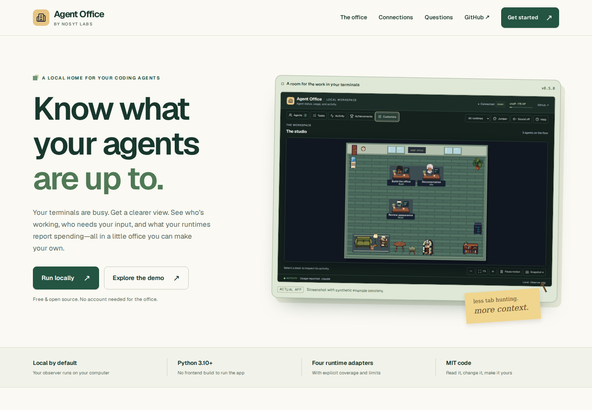
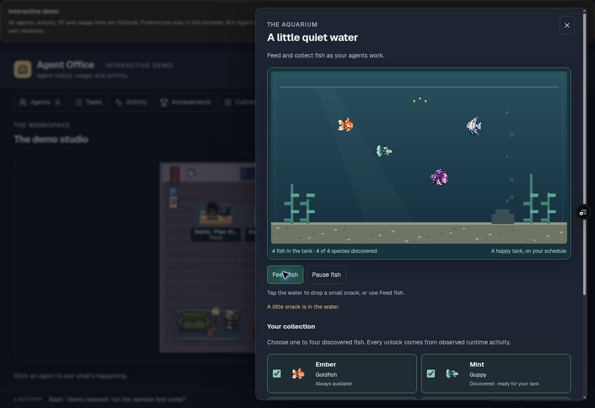

# Agent Office 0.5.0 public website and demo

The hosted preview demonstrates the same office UI with **fictional agents,
activity, XP, token usage, and cost examples**. It does not connect to local
coding tools. The page displays a persistent demo notice and labels the usage
section as synthetic. Sample costs are illustrative values, not model prices
or real charges.

The product website in `site/` explains the local observer, its setup,
capabilities, and limits. It uses actual app screenshots with synthetic
sessions, bundled licensed fonts/icons, and original page design. It performs
no analytics, model, or observer requests and writes no browser storage.
Copy buttons and keyboard tabs enhance content that also works without
JavaScript.

## Product website and GitHub Pages



Build the standalone website with:

```sh
npm run build:site
python3 -m http.server 8080 --directory site-dist
```

Open `http://127.0.0.1:8080`. The generated `site-dist/` has 19 explicit public
files plus its build manifest. Every resource and local page link is relative,
so the same output works at `/agent-office/` on GitHub Pages or `/about/` on the
existing Vercel demo. The build reads only its allowlisted source files and
screenshots, rejects symlinked inputs/outputs, and refuses to replace unrelated
directories. A failed input check preserves the previous generated output.

The [Product website workflow](../.github/workflows/pages.yml) builds on relevant
pushes to `main`, uploads only `site-dist/`, and deploys using the `github-pages`
environment. It pins checked GitHub action revisions and retains the artifact
for one day. It is a separate publishing workflow; it does not replace or
enable the existing CI workflow.

When repository metadata reports that Pages is disabled, the workflow builds
the site but skips artifact upload and deployment, with a configuration note
in its run summary. It does not repeatedly attempt an unconfigured deployment.

Before the first Pages deployment, an owner must select **Settings → Pages →
Build and deployment → Source: GitHub Actions**. GitHub repository metadata
reported `has_pages: false` during this review. The connected repository tools
do not expose Pages administration, so that setting could not be changed here.
The workflow intentionally does not auto-enable Pages or
change access settings. Use **Actions → Product website → Run workflow** after
configuration if needed. A generated Pages URL is not considered live until
its deployment succeeds and the URL is checked.

Sources: [GitHub custom Pages workflows](https://docs.github.com/en/pages/getting-started-with-github-pages/using-custom-workflows-with-github-pages)
and [configure-pages enablement requirements](https://github.com/actions/configure-pages/blob/45bfe0192ca1faeb007ade9deae92b16b8254a0d/action.yml).

Focused checks:

```sh
python -m pytest -q tests/test_site_build.py
CHROMIUM_PATH=/absolute/path/to/chrome node --test tests/site.test.cjs
```

The browser suite serves the website under `/agent-office/` on port 18125.
It checks desktop, 320/390-pixel mobile and tablet layouts, keyboard tabs,
mobile focus, actual clipboard copying and denied-clipboard recovery,
reduced motion, no-JavaScript content, credits, and local-only asset requests.
Screenshots are saved in `reports/site/` or `OFFICE_SITE_SCREENSHOTS`.

## Hosted review

[Open the live demo](https://agent-office-preview-seven.vercel.app/).
The existing production address serves the public, synthetic office. The merged
UI was verified from [commit `1b9884c`](https://github.com/NosytLabs/agent-office/commit/1b9884c637c719ef7e48b00bffe524dfca5050c9),
which Vercel built with Node **22.23.2**, producing **52 public files**. Generated
branch-preview URLs retain the project's existing deployment protection; the
public production address above needs no temporary share link.

The deployed UI was checked on 8 October 2026: agent and partial-usage panels,
room settings, loaded aquarium art and feeding, and jukebox play/stop. Usage
labels and feeding were checked again on the merged production build. The
completed sample subagent left the floor after its normal display window. No
application-origin warnings or errors appeared in the browser's captured log;
separate browser-extension metadata errors were excluded.



## Build and inspect locally

The public build has no npm package dependencies and needs Node.js 22 or later:

```sh
npm run build:preview
```

The output is the synthetic app in `dist/` and the product website in
`dist/about/`. To build only the app, use `node tools/build_preview.mjs`; its
optional `--out /path/to/preview-directory` selects a separate directory
outside the checkout. An existing generated preview can be rebuilt; an
unrelated existing directory is never replaced.

Serve that directory with any static server. The focused browser test supplies
its own Node static server on port **18120**:

```sh
python -m pytest -q tests/test_preview_build.py
node --test tests/preview.test.cjs
```

Set `CHROMIUM_PATH` when using a system Chromium executable. Browser screenshots
are saved under `reports/preview/`, or `OFFICE_PREVIEW_SCREENSHOTS` when supplied.
They contain only the public demo and public fallback fish.

## Vercel settings

Use these project settings for the reviewed branch/commit:

| Setting | Value |
| --- | --- |
| Framework | Other (`null` in the API) |
| Root directory | Repository root |
| Build command | `npm run build:preview` |
| Output directory | `dist` |
| Install command | `node --version` |
| Node.js version | 22.x |

No serverless functions, environment variables, runtime credentials, Python
build environment, or external service calls are needed. The install override
avoids downloading the repository's development-only browser/test packages.
Vercel supports custom build and output settings for static builds. Its
`package.json` Node engine range overrides the project setting, so a broad range
such as `>=22` selects the latest supported matching version; use `22.x` if
specifically pinning that major version is desired.

The build script does not deploy or create a Vercel project. The existing
`agent-office-preview` project builds the connected GitHub branch. Use the
deployment's source commit and check results when reviewing later updates.

References:

- [Vercel build configuration](https://vercel.com/docs/builds/configure-a-build)
- [Supported Node.js versions and engine overrides](https://vercel.com/docs/functions/runtimes/node-js/node-js-versions)
- [Vercel CLI project setting overrides](https://github.com/vercel/vercel/blob/main/packages/cli/src/util/projects/project-settings.ts)

## Synthetic data and interactions

`tools/generate_preview_fixture.py` creates its own temporary directories and
feeds fictional observer events through the actual `EventStore`, lifecycle
model, XP catalog, and usage ledger. Its checked-in JSON fixture includes a
working Hermes agent, Claude approval request, OpenCode work and completed
subagent, Codex activity, retained history, and both complete and partial usage
reports. A separately generated empty state supplies the reset behavior.

Regenerate the public seed after intentional schema or catalog changes:

```sh
python tools/generate_preview_fixture.py
```

The generator never opens the operator's configured office directory, event
log, or database. The schema regression compares the checked-in fixture with a
fresh isolated generation. The public Node build only reads this reviewed
fixture and the `web/assets`, `web/css`, `web/js`, and template inputs.

The build adds `preview.js` before the regular application script. It answers
the UI's state, settings, and history requests inside the browser. Timestamps
are rebased to the visit, duration counters advance, and the completed subagent
leaves after its normal display window. The fixed example does not invent new
runtime work while the page is open. Restore sample starts the fictional scene
again with fresh relative times.

Room preferences use the `agent-office:static-preview:v1` localStorage key;
validated browser view preferences use a separate demo-specific key. Neither
alters a real office. Clear demo history
removes the displayed history while preserving sample agents, XP, and usage.
Reset demo progress clears the sample agents, achievements, usage, and history
while preserving room preferences. Restore sample reinstates the original
fictional state while keeping those preferences. If browser storage is blocked,
changes last for the current visit and the notice explains that limit. Theme
changes and furniture editing customize the example; they do not generate real
observer events or increase its fixed sample activity totals.

## What a public preview cannot observe

The normal Python observer runs on the same computer as the coding runtimes and
receives their local hook/inbox events. A static Vercel deployment cannot read
those files or observe those CLI processes. Deploying a serverless function
would not give it access to a visitor's local filesystem either. To monitor
actual work, install the observer and runtime integrations locally using the
repository's setup instructions.

The public build excludes local logs, SQLite databases, runtime configuration,
the Python server, and optional Smallburg assets. The demo adapter returns 404
for `/user/aquarium/manifest.json` and local asset paths and blocks cross-origin
fetches to local or remote observers. The aquarium uses only the publicly
redistributable fallback. The builder rejects asset symlinks, private/development
asset directories, Smallburg filenames, and the exact known owner-only sheet
hashes rather than packaging them accidentally.
